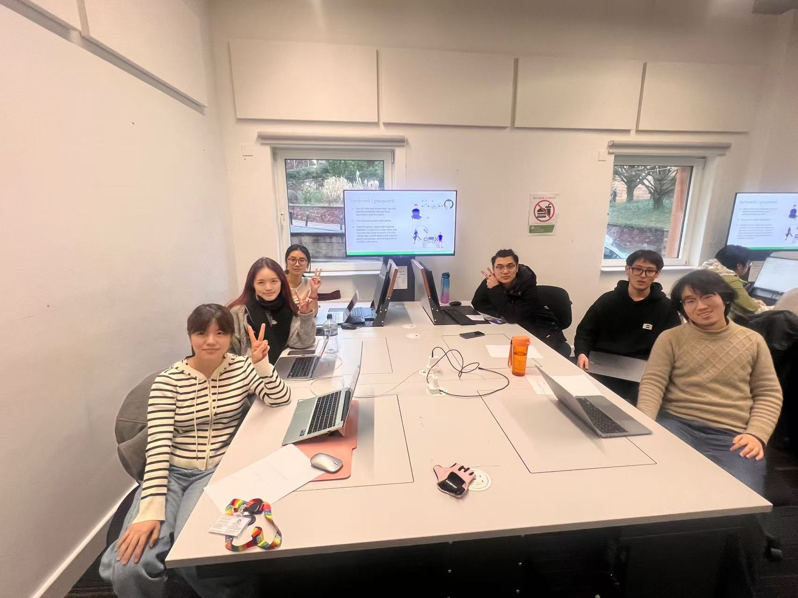

# 2025-group-4
2025 COMSM0166 group 4

## Your Game

Link to your game [PLAY HERE](https://uob-comsm0166.github.io/2025-group-4/game-prototype/)

Your game lives in the [/docs](/docs) folder, and is published using Github pages to the link above.

Include a demo video of your game here (you don't have to wait until the end, you can insert a work in progress video)

## Your Group

**The names are listed from left to right in the group photo.**

| Name                  | Email                      |
|-----------------------|---------------------------|
| Xirui Wang           | hd24605@bristol.ac.uk      |
| Suyi Dai            | zq24591@bristol.ac.uk      |
| Yihan Liu           | rv24637@bristol.ac.uk      |
| Xingchen Jin        | if24329@bristol.ac.uk      |
| Amuer               | zd24425@bristol.ac.uk      |
| Xiaoliang Su        | gp24306@bristol.ac.uk      |

## Project Report

### Introduction

- 5% ~250 words 
- Describe your game, what is based on, what makes it novel? 

### Requirements 

- 15% ~750 words
- Use case diagrams, user stories. Early stages design. Ideation process. How did you decide as a team what to develop? 

Stakeholders
User Stories & Acceptance Criteria

| User Story                  | Acceptance Criteria                      |
|-----------------------|---------------------------|
| As a game designer, I want to define the pacing and difficulty of levels so that the game remains both challenging and engaging for players.           | Given a complete level design plan, when a player attempts to complete a level, then the difficulty should align with the game’s progression curve, maintaining a balance between challenge and accessibility.      |
| As a game developer, I want the game’s physics engine to run efficiently, ensuring that 007’s jumps and evasive maneuvers respond accurately to player input.            | Given a game physics system, when a player controls 007 to jump or evade obstacles, then the character’s movement should be precise, smooth, and adhere to realistic physics, avoiding lag or unresponsiveness.      |
| As a casual player, I want the game to support auto-save functionality so that I can continue playing without losing progress.          | Given that a player has made progress in the game, when they exit, then the game should automatically save their current state so they can resume seamlessly next time.     |
| As a hardcore player, I want the game to include high-difficulty hidden levels or rewards for no-damage clears to push my limits.       | Given the unlock conditions for high-difficulty levels, when a player completes extra challenges (such as a no-damage run or a timed challenge), then they should receive unique rewards or unlock new content to enhance the sense of achievement.      |
| As a story-driven player, I want the game to offer rich storytelling through text or visuals so that I can fully immerse myself in 007’s journey.             | Given key narrative moments, when a player reaches certain conditions, then the game should present detailed cutscenes or text to enhance the storytelling experience.      |
| As a completionist, I want to unlock all puzzle pieces and hidden items so that I can achieve 100% game completion.        | Given a collection system, when a player acquires all hidden items or reaches full completion goals, then the game should provide a progress tracker and additional rewards to encourage exploration.      |

### Design

- 15% ~750 words 
- System architecture. Class diagrams, behavioural diagrams. 

### Implementation

- 15% ~750 words

- Describe implementation of your game, in particular highlighting the three areas of challenge in developing your game. 

### Evaluation

- 15% ~750 words

- One qualitative evaluation (your choice) 

- One quantitative evaluation (of your choice) 

- Description of how code was tested. 

### Process 

- 15% ~750 words

- Teamwork. How did you work together, what tools did you use. Did you have team roles? Reflection on how you worked together. 

### Conclusion

- 10% ~500 words

- Reflect on project as a whole. Lessons learned. Reflect on challenges. Future work. 

### Contribution Statement

- Provide a table of everyone's contribution, which may be used to weight individual grades. We expect that the contribution will be split evenly across team-members in most cases. Let us know as soon as possible if there are any issues with teamwork as soon as they are apparent. 

### Additional Marks

You can delete this section in your own repo, it's just here for information. in addition to the marks above, we will be marking you on the following two points:

- **Quality** of report writing, presentation, use of figures and visual material (5%) 
  - Please write in a clear concise manner suitable for an interested layperson. Write as if this repo was publicly available.

- **Documentation** of code (5%)

  - Is your repo clearly organised? 
  - Is code well commented throughout?
