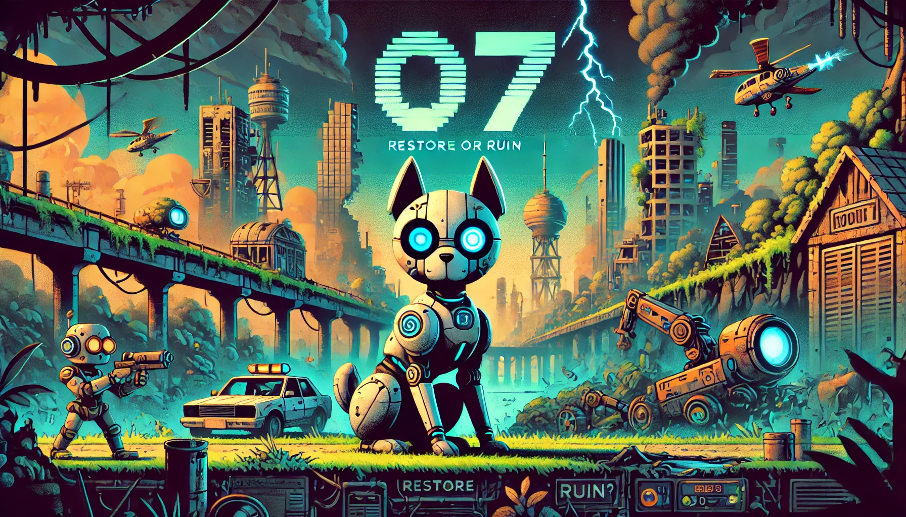
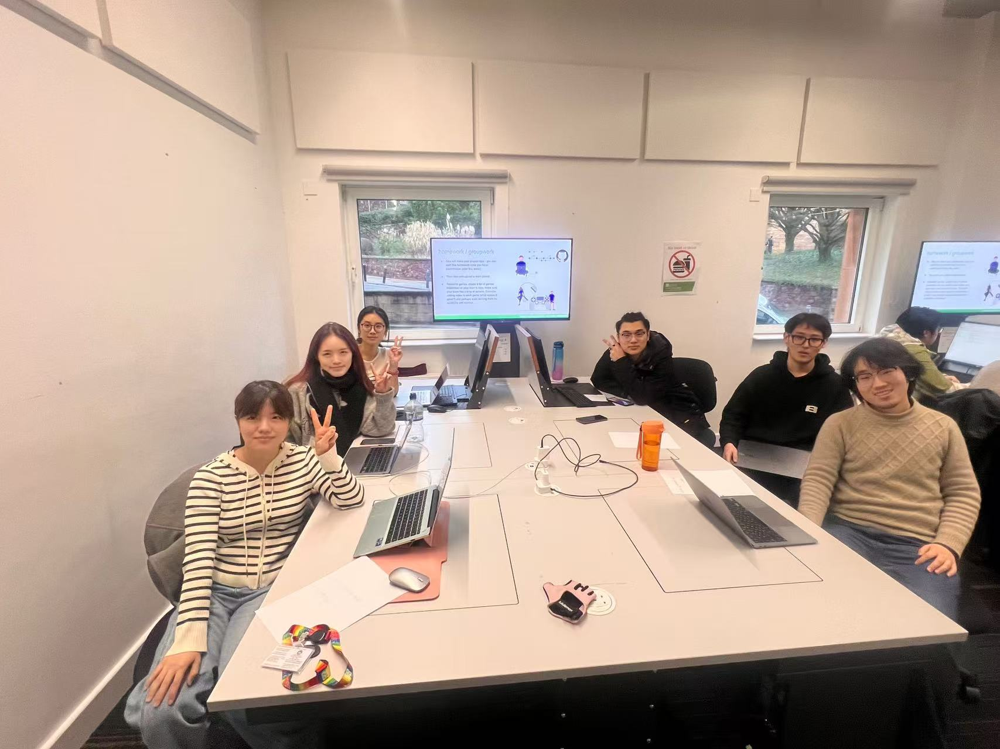
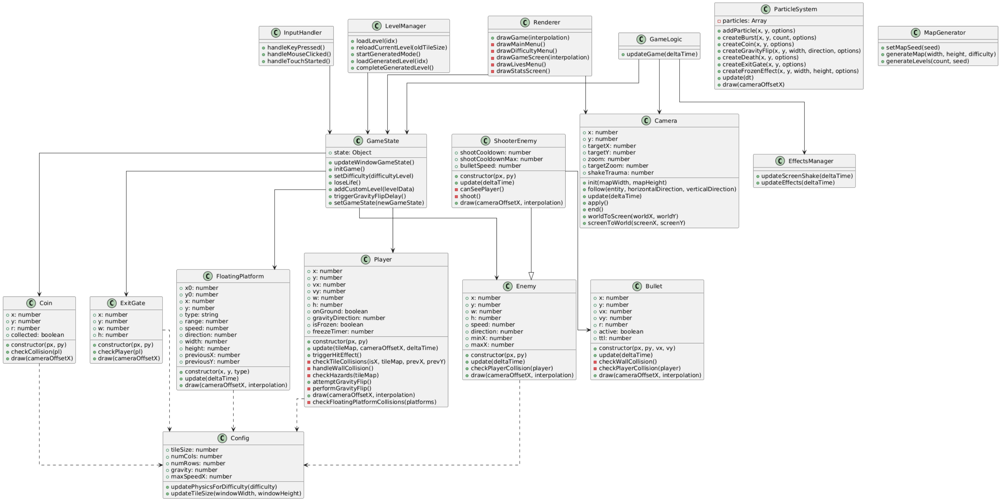
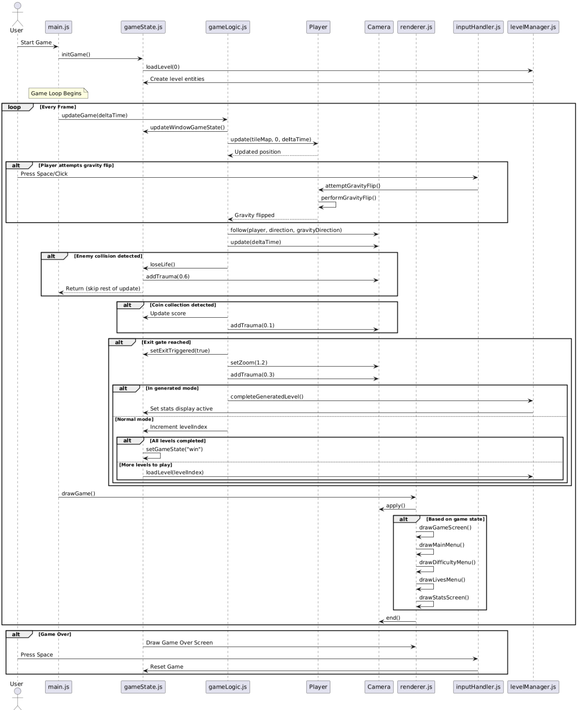
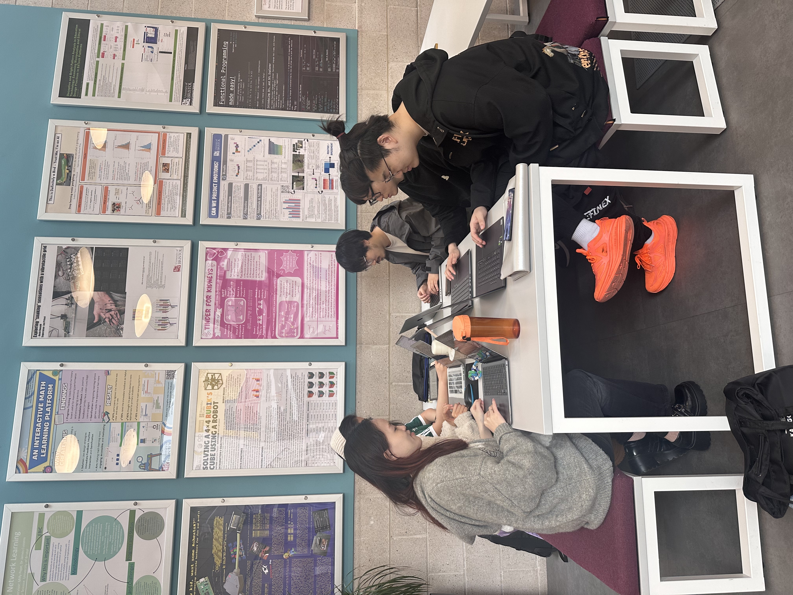
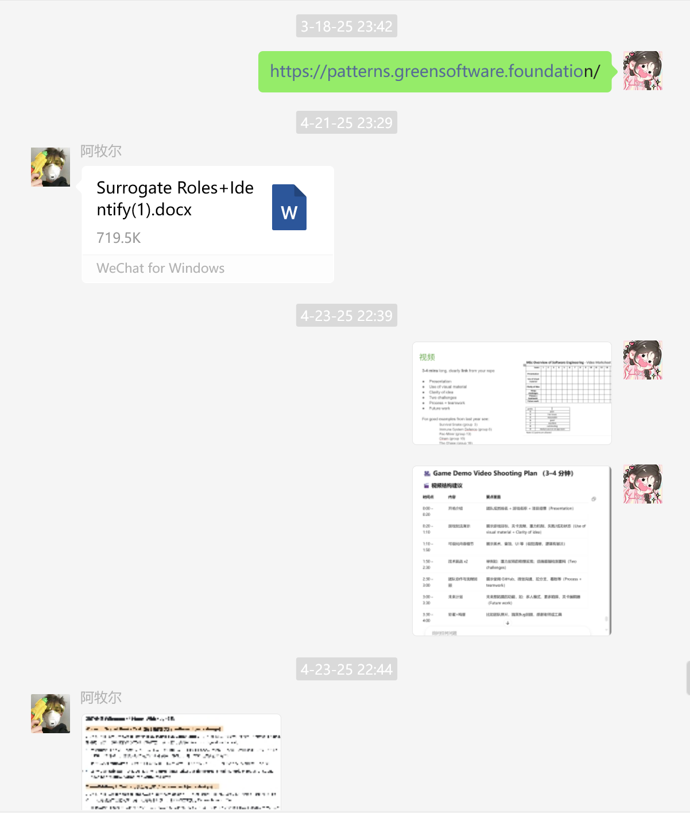
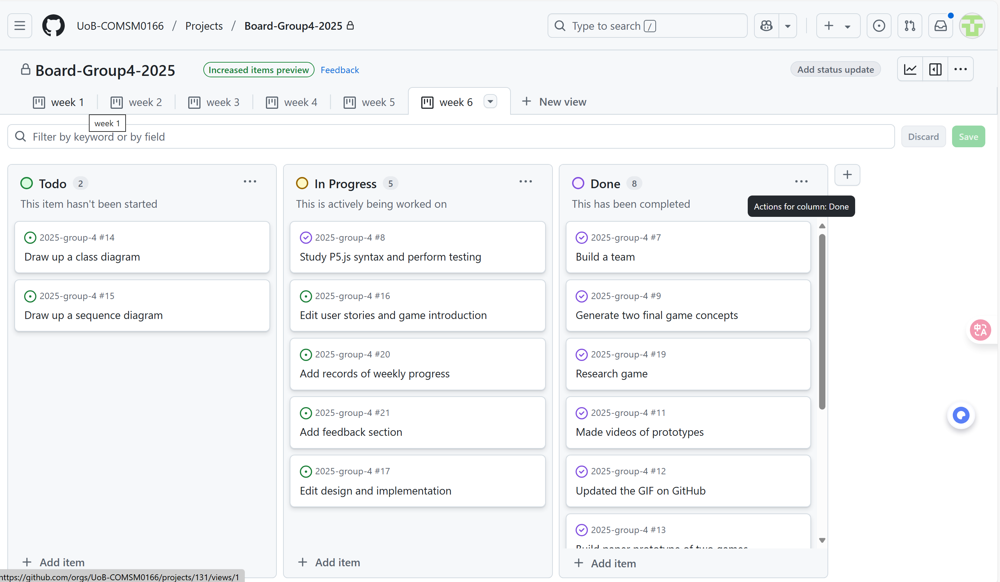
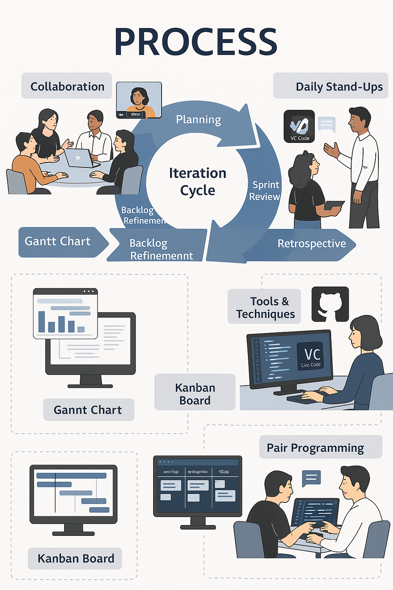

# 2025-group-4

2025 COMSM0166 group 4

# Puppy's Magical Adventure

<div align="center">
    
</div>


<div align="center">
  <h2>
    <a href="https://uob-comsm0166.github.io/2025-group-4/" style="display: inline-block; background-color: #4CAF50; color: white; padding: 10px 20px; text-decoration: none; border-radius: 5px; font-weight: bold; margin: 20px 0;">🎮 PLAY HERE 🎮</a>
  </h2>
</div>

<div align="center">
  <a href="https://github.com/orgs/UoB-COMSM0166/projects/131"></a>
  
</div>

<div align="center">
  <a href="https://youtu.be/bFDjtvlrYy0">
    
  </a>
  <p><strong>🎥&nbsp;&nbsp;&nbsp;&nbsp;Demo Video&nbsp;&nbsp;&nbsp;&nbsp;🎥</strong></p>
</div>

---

## Table of Contents

<details open>
<summary><b>Click to expand/collapse</b></summary>

- [1. Development Group](#1-development-group)
- [2. Kanban link](#2-kanban-link)
- [3. Project Report](#3-project-report)
  - [3.1 Introduction](#31-introduction)
    - [3.1.1 Game Background](#311-game-background)
    - [3.1.2 Game Mechanics](#312-game-mechanics)
    - [3.1.3 Game Innovation](#313-game-innovation)
    - [3.1.4 Level Themes & Biomes](#314-level-themes--biomes)
    - [3.1.5 Endings](#315-endings)
    - [3.1.6 Stakeholders](#316-stakeholders)
    - [3.1.7 Identifying Top-Level Needs with User Stories](#317-identifying-top-level-needs-with-user-stories)
- [4. Game Design – Puppy's Magical Adventure](#4-game-design--puppys-magical-adventure)
  - [4.1 Use Case diagram](#41-use-case-diagram)
  - [4.2 Procedural Challenge Mode Use Case Specification](#42-procedural-challenge-mode-use-case-specification)
  - [4.3 Summary of Development & Ideation Process](#43-summary-of-development--ideation-process)
  - [4.4 Game Architecture & Visual Modeling](#44-game-architecture--visual-modeling)
    - [4.4.1 Class Diagram](#441-class-diagram)
    - [4.4.2 Sequence Diagram](#442-sequence-diagram) 
    - [4.4.3 State Diagram](#443-state-diagram)
  - [4.5 Game Mechanics Summary](#45-game-mechanics-summary)
- [5. Implementation](#5-implementation)
  - [5.1 Implementation of a time-independent physics system and a stable collision mechanism](#51-implementation-of-a-time-independent-physics-system-and-a-stable-collision-mechanism)
  - [5.2 A map editor with a player-defined map feature](#52-a-map-editor-with-a-player-defined-map-feature)
  - [5.3 The random creation of maps](#53-the-random-creation-of-maps)
- [6. Evaluation](#6-evaluation)
  - [6.1 Qualitative Evaluation](#61-qualitative-evaluation)
  - [6.2 Heuristic Evaluation](#62-heuristic-evaluation)
  - [6.3 Quantitative Analysis](#63-quantitative-analysis)
- [7. Code Testing](#7-code-testing)
  - [7.1 White-box Testing](#71-white-box-testing)
  - [7.2 Black-box Testing](#72-black-box-testing)
  - [7.3 Summary](#73-summary)
- [8. Summary & Future Improvements](#8-summary--future-improvements)
- [9. Sustainability](#9-sustainability)
  - [9.1 Project Overview](#91-project-overview)
  - [9.2 Sustainability Dimension Analysis](#92-sustainability-dimension-analysis)
  - [9.3 Sustainability Effects – Chains of Impact](#93-sustainability-effects--chains-of-impact)
  - [9.4 Threats, Opportunities, Actions](#94-threats-opportunities-actions)
  - [9.5 Sustainability User Stories](#95-sustainability-user-stories)
  - [9.6 Sustainability Score Overview](#96-sustainability-score-overview-out-of-10)
  - [9.7 Accessibility Focus](#97-accessibility-focus)
- [10. Process](#10-process)
  - [10.1 Collaboration](#101-collaboration)
  - [10.2 Tools and Techniques](#102-tools-and-techniques)
  - [10.3 Agile Methodology](#103-agile-methodology)
  - [10.4 Visuals](#104-visuals)
  - [10.5 Contribution to Development Process](#105-contribution-to-development-process)
- [11. Conclusion](#11-conclusion)
</details>

---

# 1. Development Group
<p align="center">
  <strong>Figure 1</strong><br>
  <em>Group Photo</em>
</p>

<p align="center">
  
</p>

**The names are listed from left to right in the group photo.**

| Name                  | Email                      |
|-----------------------|---------------------------|
| Xirui Wang           | hd24605@bristol.ac.uk      |
| Suyi Dai            | zq24591@bristol.ac.uk      |
| Yihan Liu           | rv24637@bristol.ac.uk      |
| Xingchen Jin        | if24329@bristol.ac.uk      |
| Amuer               | zd24425@bristol.ac.uk      |
| Xiaoliang Su        | gp24306@bristol.ac.uk      |

# 2. Kanban link
<div align="center">
  <a href="https://github.com/orgs/UoB-COMSM0166/projects/131">
    
  </a>
</div>

# 3. Project Report

Before any code was written, we explored gameplay ideas using hand-drawn paper prototypes. This helped us define core mechanics such as gravity reversal and trap placement.

<p align="center">
  <strong>Figure 2</strong><br>
  <em>Paper Prototypes</em>
</p>

<p align="center">
  
</p>

## 3.1 Introduction

### 3.1.1 Game Background
- A magical catastrophe shattered the world, leaving only floating islands adrift in the sky. Ancient civilisations collapsed, and wild arcane energy now flows through broken landscapes filled with danger, mystery, and forgotten magic.
- You are a magical creature—an exiled, sentient dog cast out by its own kind. Armed with instinct and arcane power, you must navigate through frozen glaciers,  cursed jungles, and twisted forests suspended in the sky. Each realm pulses with unstable magic, hiding secrets—and death—at every turn.
- Watch your step. Triangular spikes jut from the ground and sky. Razor-sharp thorn clusters in the forest are fatal to the touch. There are no second chances.
- Your journey leads to **Death Cliff**—the last known fragment of the World Core. Only by surviving the trials of magic and reclaiming your lost power can you unlock the secret to restoring the world.
-- **"Survive the skies. Master the magic. Reconnect the realms."**


---

## 3.1.2 Game Mechanics
- The game features a fast-paced, roguelike platforming system with procedurally generated levels.
- Each run includes:
  - **Limited lives & checkpoints (difficulty varies by mode)**
  - **Coin collection to increase score**
  - **Environmental hazards like spikes, enemies, and moving traps**
  - **One-way gates and portals to guide progression**
- Character mobility such as gravity reversal, jumping, wall-sliding.
- Players must adapt quickly, react precisely, and memorize patterns to reach the end before losing all lives.

<p align="center">
  <strong>Figure 3</strong><br>
  <em>Game Mechanics</em>
</p>

<p align="center">
  
</p>

---

## 3.1.3 Game Innovation
1. **Multi-biome progression**: 
   - Players move through visually distinct zones (ice, cloud, jungle, night, fire, castle, ruins), each with unique trap logic and enemy behaviours.
2. **Dynamic difficulty modes**: 
   - Easy (99 lives), Hard (5 lives), and Random (10 lives) offer replay value for both casual and hardcore players.
3. **Subtle narrative layering**: 
   - While the game remains gravity reversal, action-centric, visual hints (ruins, portals, character design) suggest a deeper backstory about a fractured world and lost civilisations.
4. **Precision-based skill challenge**: 
   - Inspired by classic arcade platformers, each level demands reflexes, timing, and risk-reward mastery.

<p align="center">
  <strong>Figure 4</strong><br>
  <em>Slides and Fire Traps Demo</em>
</p>

<p align="center">
  
</p>

---

## 3.1.4 Level Themes & Biomes

<div class="biome-container">

#### 1. Enchanted Grove
- **Theme**: Lush, glowing forest filled with bioluminescent plants and soft green light.
- **Biome Characteristics**: 
  - Calm, magical atmosphere with shimmering flora
  - Coin clusters to encourage exploration and reward risk-taking
- **Focus**: Introduction to movement, jumping, and obstacle avoidance in a visually soothing environment.

#### 2. Thorny Thicket
- **Theme**: A dense, enchanted forest surrounded by magical thorns; the mysterious atmosphere remains, but danger noticeably increases.
- **Biome Characteristics**: 
  - Environment packed with thorn traps lining all sides
  - Introduction of spiked hazards, adding dynamic threats
  - Tight level design demanding precise movement
- **Focus**: Tests the player's dodging, timing, and spatial awareness; introduces dynamic danger elements for the first time.

#### 3. Shadow Outpost
- **Theme**: A hidden outpost deep within the glowing forest, now guarded by patrolling enemies. The atmosphere shifts from mysterious to tense.
- **Biome Characteristics**: 
  - Bioluminescent forest background continues, with added enemy guards
  - Enemies patrol and block paths, requiring smart dodging or precise timing
  - Coin placement tempts players to take risks near enemies, increasing the challenge
- **Focus**: Tests the player's ability to avoid enemies, manage movement rhythm, and maintain precision — first introduction of active threats.

#### 4. Crimson Ambush
- **Theme**: The enchanted forest now hosts red, bullet-firing enemies, introducing long-range threats and sharply increasing tension.
- **Biome Characteristics**: 
  - Bioluminescent forest backdrop continues, with the addition of crimson ranged foes
  - Enemies shoot projectiles, requiring precise movement and quick reflexes
  - Moving thorn hazards from earlier levels remain, creating layered challenges
- **Focus**: Tests the player's reaction speed, movement precision, and multitasking ability — marking a clear difficulty spike

#### 5. Frozen Labyrinth
- **Theme**: A glacial labyrinth replaces the forest, introducing icy terrain and a fresh visual experience.
- **Biome Characteristics**: 
  - Ice block platforms with slippery surfaces and hard walls
  - Sharp ice spikes act as deadly traps, increasing pathfinding complexity
  - Maze-like level design demanding careful observation and route selection
- **Focus**: Tests the player's path planning, jump precision, and maneuvering in tight spaces.

#### 6. Wild Jungle
- **Theme**: A vivid tropical jungle bursting with life, introducing sharp mountain spikes and moving grass platforms to heighten the challenge.
- **Biome Characteristics**: 
  - Lush jungle backdrop filled with vines, massive trees, and tropical flowers
  - Sharp spikes as new lethal obstacles, demanding precise jumps
  - Moving grass platforms add unpredictability, requiring players to observe and time their movements
- **Focus**: Tests the player's adaptability to dynamic terrain, observational skills, and mastery of jump timing.

#### 7. Nightfall Ruins
- **Theme**: A silent, moonlit ruin with an eerie atmosphere. Sharp stone spikes now pose deadly threats.
- **Biome Characteristics**: 
  - Dark ruin backdrop with ancient brick structures
  - Sharp stone spikes placed on floors and ceilings as lethal traps
  - Players must navigate using limited visual cues in the dark
- **Focus**: Tests player's spatial awareness, focus, and ability to avoid fatal traps while staying calm under low-visibility conditions.

#### 8. Magma Fortress
- **Theme**: A blazing magma fortress filled with imminent danger. Newly introduced ice blocks provide freezing effects, alongside weapon-firing enemies and deadly red spikes.
- **Biome Characteristics**: 
  - Lava background with red brick platforms, evoking intense heat
  - Ice blocks introduce a freezing mechanic, adding environmental variety
  - Weapon-firing enemies and red spikes create multidirectional threats
  - Players must navigate flexibly through layered hazards
- **Focus**: Tests the player's strategic planning, quick reflexes, and survival skills in a highly complex environment.

#### 9. Sky Citadel
- **Theme**: A soaring sky citadel built of ice blocks, where danger meets altitude, and bow-wielding demons enter the fray.
- **Biome Characteristics**: 
  - Cloudy backdrop with an icy maze suspended in the sky
  - Bow-wielding demon enemies launch ranged attacks
  - Ice spikes remain as hazards, requiring careful coordination with enemy movement
- **Focus**: Tests aerial maneuvering, reactions to ranged threats, and precision in jumping and dodging.

#### 10. Mystic Cavern
- **Theme**: The final level descends into an underground ravine maze, with a dark, oppressive atmosphere and collapsing world lore.
- **Biome Characteristics**: 
  - Dark cave backdrop with maze-like passages
  - Demon enemies patrol narrow corridors, posing constant threats
  - Floor spikes demand precise footwork
  - Maze layout challenges player's memory and pathfinding skills
- **Focus**: Tests patience, route memorization, enemy avoidance, and survival strategy — the ultimate test of mastery.

</div>

---

### 3.1.5 Endings
#### Perfect Ending
You collect all energy shards, stabilize the gravity core, and unlock the final gate. Earth is restored, humanity returns, and you become the savior of the new world.

> "Earth is restored. You are the last spark that re-lit the future."

#### Tragic Ending
You fall before the final gate. The floating world collapses, swallowed by the void.

> "The world collapses. Your legacy fades into dust."

---

### 3.1.6 Stakeholders
#### Surrogate Roles
##### Onion Model of game Puppy's Magical Adventure

<p align="center">
  <strong>Figure 5</strong><br>
  <em>Onion Model</em>
</p>

<p align="center">
  
</p>

Our Onion Model (Figure 5) revealed a significant finding: the identification of "surrogate roles" in the game development process, as outlined by Ian Alexander. Surrogates serve as representatives for larger user groups. While game testers and reviewers were not our direct target audience, their feedback provided insights from players of various demographics.

For Puppy's Magical Adventure, the surrogates involved were professional game designers, advocates for accessibility, and AI researchers. They provided particularly valuable insights for fine-tuning gameplay mechanics, making sure our gravity manipulation system felt intuitive, and addressing accessibility concerns. We tailored the pacing, difficulty balance, and user experience of our game to suit different play styles by utilising surrogate roles. This method proved especially beneficial during user testing and qualitative assessments. It was possible for us to carry out iterative testing sessions with surrogate users, like other developers and playtest groups, without having to initially reach the whole target audience. This process had a considerable effect on data gathering and game improvement.

Nonetheless, surrogate roles also present challenges.  Surrogate feedback that does not align with real player expectations can present risks.  For instance, if testers focused on accessibility deemed the gravity manipulation puzzles intuitive because of their knowledge of game mechanics, while casual players found them challenging, modifications were required.  In order to reduce these risks, we supplemented surrogate input with direct feedback from a variety of players, guaranteeing that the game was evaluated in a balanced and representative manner.

It is ensured that Puppy's Magical Adventure was engaging, accessible, and mechanically sound for its core audience by strategically integrating surrogate roles and validating their insights with real players.

---

### 3.1.7 Identifying Top-Level Needs with User Stories
#### User Posters of four different player types

<p align="center">
  <strong>Figure 6</strong><br>
  <em>User Posters</em>
</p>

<div align="center">
  
  
</div>
<div align="center">
  
  
</div>

To better understand what features we should prioritise, we created user stories.

Our team designed several posters featuring characters to represent these user stories, ensuring personalization and keeping them in mind.

---

<div align="center">
  <strong>Table 1</strong><br>
  <em>User Stories & Acceptance Criteria</em>
</div>

| User Story                  | Acceptance Criteria                      |
|-----------------------|---------------------------|
| As a game designer, I want to define the pacing and difficulty of levels so that the game remains both challenging and engaging for players.           | Given a complete level design plan, when a player attempts to complete a level, then the difficulty should align with the game's progression curve, maintaining a balance between challenge and accessibility.      |
| As a game developer, I want the game's physics engine to run efficiently, ensuring that 007's jumps and evasive maneuvers respond accurately to player input.            | Given a game physics system, when a player controls 007 to jump or evade obstacles, then the character's movement should be precise, smooth, and adhere to realistic physics, avoiding lag or unresponsiveness.      |
| As a casual player, I want the game to support auto-save functionality so that I can continue playing without losing progress.          | Given that a player has made progress in the game, when they exit, then the game should automatically save their current state so they can resume seamlessly next time.     |
| As a hardcore player, I want the game to include high-difficulty hidden levels or rewards for no-damage clears to push my limits.       | Given the unlock conditions for high-difficulty levels, when a player completes extra challenges (such as a no-damage run or a timed challenge), then they should receive unique rewards or unlock new content to enhance the sense of achievement.      |
| As a story-driven player, I want the game to offer rich storytelling through text or visuals so that I can fully immerse myself in 007's journey.             | Given key narrative moments, when a player reaches certain conditions, then the game should present detailed cutscenes or text to enhance the storytelling experience.      |
| As a completionist, I want to unlock all puzzle pieces and hidden items so that I can achieve 100% game completion.        | Given a collection system, when a player acquires all hidden items or reaches full completion goals, then the game should provide a progress tracker and additional rewards to encourage exploration.      |

---

## 4. Game Design – Puppy's Magical Adventure
## 4.1 Use Case diagram
<p align="center">
  <strong>Figure 7</strong><br>
  <em>Use Case diagram</em>
</p>

<p align="center">
  
</p>

---

<div align="center">
  <strong>Table 2</strong><br>
  <em>Standard Mode VS Random Mode (Use Case)</em>
</div>

| **Standard Mode** |   |
|-------------------|---|
| **Description** | A level focused on gravity-switch platforming using only the spacebar. Enemy positions and hazards are fixed. |
| **Basic Flow** | **Goal:** Reach the end by flipping gravity at the right time, collecting items, and avoiding enemies. |
| **Step One** | Player presses **Spacebar** to flip gravity, switching between floor and ceiling traversal. |
| **Step Two** | Player collects **Gold Coin** . |
| **Step Three** | Certain platforms or obstacles are triggered by proximity or player movement. |

| **Random Mode** |   |
|------------------|---|
| **Alternative Flow** | **Challenges:** Running out of time, falling off-screen, or colliding with invulnerable enemies ends the run. |
| **Step One (Alt)** | Collision with enemies = lose 1 life. Player starts with 3 lives. |
| **Step Two (Alt)** | After 3 failed attempts at the same section, a hint is displayed to suggest a timing or path change. |
| **Step Three (Alt)** | Optional **Gold coin** can be collected (no gameplay effect). |

---

## 4.2 Procedural Challenge Mode Use Case Specification

<div align="center">
  <strong>Table 3</strong><br>
  <em>Standard Mode VS Random Mode (Procedural Challenge Mode)</em>
</div>

| **Standard Mode** |   |
|-------------------|---|
| **Description** | A level with pre-designed traps and enemies. Gravity flipping via spacebar is essential. |
| **Advanced Flow** | Players can learn the layout and improve timing with repeated attempts. |
| **Step One** | Flip gravity using **Spacebar** to dodge hazards and navigate fixed obstacles. |
| **Step Two** | Difficulty increases slightly with level progression but remains consistent across sessions. |
| **Step Three** | Completion rewards include **time ranks** and **collectible counts**. |

| **Random Mode** |   |
|------------------|---|
| **Description** | The same level design, but traps and enemy placements are randomized each run. |
| **Advanced Flow** | Players must react and adapt to changes in the environment with each attempt. |
| **Step One** | Flip gravity using **Spacebar**, but obstacles may spawn in new positions, increasing unpredictability. |
| **Step Two** | Difficulty is scaled dynamically based on player performance (adaptive speed and obstacle density). |
| **Step Three** | Coin points awarded for completing unpredictable runs efficiently. |

---

## 4.3 Summary of Development & Ideation Process

<div class="development-process">

**1. Initial Concept**  
- Inspired by *The Way of the Dodo*, the game was originally a simple one-button platformer.  
- The team introduced a gravity-flip mechanic to differentiate it from similar games.

**2. Refinement & Evolution**  
- Early iterations felt too linear, so we introduced more interactive environments.  
- A magic world and a magic dog gave it identity and story.

**3. Gameplay Enhancements**  
- Added time pressure and limited lives to balance challenge vs accessibility.  
- Environmental storytelling was layered into gameplay.  
- Hidden reward exploration.

**4. Final Adjustments**  
- Difficulty curve tuned for fairness and fun.  
- UI simplified, controls tightened.  
- Pixel art and lightweight assets ensure smooth performance.

</div>

---

## 4.4 Game Architecture & Visual Modeling

### 4.4.1 Class Diagram  
**File**: `./images/class-diagram.png`  
The class diagram outlines object relationships in our game system and supports modular, object-oriented structure.

- `Player`: manages gravity flip, movement, collision detection  
- `Enemy` / `ShooterEnemy`: define enemy movement and bullet logic  
- `GameState` / `LevelManager`: handle overall game flow and level transitions  
- `Renderer`, `Camera`: control drawing and visual effects  
- `InputHandler`: responds to user keyboard/mouse/touch input  
- `Bullet`, `Coin`, `ExitGate`, `FloatingPlatform`: represent environmental elements  
- `Config`: centralises constants for difficulty and level layout

<p align="center">
  <strong>Figure 8</strong><br>
  <em>Class Diagram</em>
</p>

<p align="center">
  
</p>

---

### 4.4.2 Sequence Diagram  
**File**: `./images/sequence-diagram.png`  
This diagram illustrates runtime logic and how game events propagate.

- The user starts the game → triggers `initGame()` → `loadLevel()`  
- `updateGame(deltaTime)` runs every frame  
- Gravity flip via Spacebar calls:  
  `attemptGravityFlip()` → `performGravityFlip()` → `Camera.follow()`  
- Collisions with objects affect lives, score, or progression  
- Renderer updates visual elements based on game state

<p align="center">
  <strong>Figure 9</strong><br>
  <em>Sequence Diagram</em>
</p>
   
<p align="center">
  
</p>

---

### 4.4.3 State Diagram  
**File**: `./images/state-diagram.png`  
We designed a hierarchical FSM to control game progression.

- Top states: `MainMenu`, `Play`, `Editor`, `GameOver`, `Win`, `Stats`  
- Inside `Play`: substates include `Moving`, `Jumping`, `Frozen`, `Hit`, `Falling`  
- Transitions include: player input (Spacebar), collision with enemy, reaching `ExitGate`, losing all lives

This diagram supports both functional transitions and UI switching.

<p align="center">
  <strong>Figure 10</strong><br>
  <em>State Diagram</em>
</p>

<p align="center">
  
</p>

---

## 4.5 Game Mechanics Summary

<div class="mechanics-summary">

- **Gravity Flip**: The player can flip gravity using Spacebar to swap between floor and ceiling.  
- **Enemy Logic**: Contact with enemies or bullets results in life loss. Shooter enemies fire projectiles.  
- **Coins & Exit**: Coins boost score; reaching ExitGate completes the level.  
- **Difficulty Scaling**: Random mode adjusts speed and spawn density based on performance.  
- **Procedural Generation**: Some levels are generated using custom seed + difficulty logic.  
- **Camera & Visuals**: Interpolated camera movement, screen shake, UI state indicators.  
- **GameState Management**: Controls life count, transitions, and HUD rendering.

</div>

---

# 5. Implementation

## 5.1 Implementation of a time-independent physics system and a stable collision mechanism

### 5.1.1 Objectives and motivations

A primary objective was to deliver a consistent and smooth gameplay experience across diverse hardware and varying refresh rates. The player character's movement, particularly the gravity-flip mechanic, needed to be predictable and responsive. Interactions with the environment, such as landing on platforms or hitting obstacles, had to be stable and feel fair. This necessitated a physics and collision system that was accurate, efficient, and robust, forming the bedrock of the player's interaction with the game world.

### 5.1.2 Fixed time step mechanism (FTM) and Collision Handling

To counteract inconsistencies arising from fluctuating frame rates—a common issue that can lead to problems like variable jump heights or objects passing through each other (tunneling)—we implemented a fixed timestep update loop. The core game logic, including physics calculations, is driven by a `deltaTime` value, which represents the actual elapsed time between frames, rather than assuming a constant frame duration. This `deltaTime`, calculated in `main.js` using `millis()` and constrained to a maximum value to prevent extreme updates during significant lag spikes, ensures that game events progress consistently regardless of the rendering speed. For instance, gravity (`player.vy += timeScaledGravity * this.gravityDirection;`) and movement updates in `player.js` are scaled by this `deltaTime`, ensuring the puppy moves the same perceived distance over time, whether the game runs at 30 FPS or 60 FPS.

Collision detection was a critical area requiring careful design. Our approach involved:

1.  **Separation of Axes**: Horizontal and vertical collisions are processed independently within the `player.js` `checkTileCollisions` method. This simplifies the logic for determining collision points and resolving overlaps.
2.  **Incremental Stepped Checks for Fast Movements**: To prevent the player from "tunneling" through thin platforms or walls when moving at high speeds (a common challenge in physics engines), vertical movement is broken down into smaller increments if the velocity is high for a single frame (`const steps = Math.max(1, Math.ceil(Math.abs(scaledVy) / 5));`). Collisions are then checked at each of these smaller steps.
3.  **Precise Collision Response**: Upon detecting a collision, the player's position is meticulously adjusted to sit just outside the collided tile (e.g., `this.x = rightCol * tileSize - halfW;`), preventing sticking or jittering.
4.  **Dynamic Ground Detection for Gravity Flips**: The gravity-flip mechanic is central to gameplay. The collision system dynamically determines what constitutes "ground" based on the `player.gravityDirection`. When gravity is flipped, the ceiling effectively becomes the floor for collision purposes. The player character doesn't climb or perform traditional jumps; instead, after a flip, they "fall" in the new direction of gravity and can navigate by chaining further flips. This dynamic evaluation is evident in how vertical collisions differentiate between downward movement relative to normal gravity and downward movement relative to flipped gravity.

A significant challenge was ensuring pixel-perfect collision without being overly punitive, especially around corners or with fast-moving objects like floating platforms. This was addressed through careful sizing of hitboxes (`this.w = tileSize * 0.9; this.h = tileSize * 0.9;` in `Player` constructor, and slightly smaller dimensions for checks in `checkTileCollisions`), and by implementing a grace period for gravity flip inputs (`GROUND_GRACE_PERIOD`, `allowBufferedFlipWhileAir`).

The refined physics and collision system, including dedicated checks for `floatingPlatforms`, ultimately provided a stable and predictable environment for the player's acrobatic maneuvers.

<p align="center">
  <strong>Figure 11</strong><br>
  <em>Gravity Reversal Demo</em>
</p>

<p align="center">
  
</p>

The system's handling of the gravity flip is crucial. When the player initiates a flip, the `gravityDirection` attribute of the player object is inverted. Collision logic then interprets "down" relative to this new direction. For example, when checking for landing, the system looks for solid tiles in the direction of the current gravity. This allows the player to seamlessly transition between floor and ceiling traversal.

<p align="center">
  <strong>Figure 12</strong><br>
  <em>Spikes & Enemies Demo</em>
</p>

<p align="center">
  
</p>

### 5.1.3 Importance of the system and potential for expansion

This carefully architected physics and collision system forms a reliable foundation for "Puppy's Magical Adventure." Its time-independent nature ensures a fair experience across different devices. The robustness of collision detection and response allows for intricate level designs featuring tight passages and precisely timed hazards. This system not only elevates the current gameplay but also provides a solid technical base for future expansions, such as introducing new enemy types with unique movement patterns or more complex environmental interactions.

---

## 5.2 A map editor with a player-defined map feature

### 5.2.1 Objectives and motivations

To extend replayability and foster player creativity, we aimed to develop an intuitive in-game map editor. The goal was to allow players to design their own levels using a simple graphical interface and then immediately test their creations within the main game. This feature was envisioned to empower users to become co-creators, potentially leading to a community-driven content ecosystem.

### 5.2.2 Graphic map editor and WYSIWYG Testing

The map editor, primarily implemented in `levelEditor.js`, represents levels as a 2D character grid (`editorGrid`). Each character corresponds to a specific game element (e.g., '1' for solid ground, '2' for a coin, '3' for player start), defined in the `TILES` object. The editor provides a visual abstraction over this grid:

*   **Interactive Canvas**: Players can directly "paint" tiles onto the grid using the mouse. The selected `currentTile` determines what gets placed.
*   **Navigation**: Panning (`editorOffsetX`, `editorOffsetY`) and zooming (`editorScale`) allow users to work on maps of various sizes.
*   **Advanced Tools**: Features like area selection (`selectionArea`), copy (`copySelection`), and paste (`pasteSelection`) streamline the design process for more complex structures.
*   **Immediate Feedback**: The HUD displays crucial information like cursor position and selected tile, and a message system (`showMessage`) provides contextual feedback.

A key challenge was ensuring a seamless transition from designing a map to playing it. We implemented a "What You See Is What You Get" (WYSIWYG) testing mechanism:

1.  **Export and Validation**: The `exportLevel()` function converts the `editorGrid` into the game's level format. Crucially, it performs basic validation, checking for the presence of essential elements like a player start point ('3') and an exit gate ('4'). This prevents users from exporting broken or unplayable levels.
2.  **Dynamic Level Loading**: If validation passes, the exported level data can be added to the game's active level list (via `addCustomLevel` in `game.js`, called from `main.js`'s `exportEditorLevel` function).
3.  **Playtest Mode**: A dedicated playtest mode (`window.playtestMode`) allows designers to instantly switch from the editor to playing their current creation with infinite lives. Pressing 'P' in the editor triggers this, loading the custom map using `loadGameLevel`.

This tight integration between creation and testing tools was vital. The main technical hurdle was managing the editor's state (selected tools, view offsets, clipboard) independently while still allowing it to interface correctly with the game's level loading and rendering systems.

### 5.2.3 Towards a sustainable content ecosystem

The map editor transcends a simple creation tool; it embodies our vision for a player-driven content ecosystem. By enabling users to design and share their own challenges, the game's lifespan is potentially extended far beyond officially curated levels. This also introduces players to rudimentary level design principles—spatial reasoning, hazard placement, and flow—in an engaging, hands-on manner. Future plans could involve integrating a system for sharing and rating user-created maps, further solidifying this community aspect.

---

## 5.3 The random creation of maps

### 5.3.1 Goals and motivations

To enhance replayability and provide a consistently fresh challenge, particularly for the "Random Mode", we developed a procedural map generation system. Unlike fixed, manually designed maps, randomly generated levels ensure that each playthrough offers unique spatial layouts, enemy placements, and collectible distributions. This encourages adaptability and strategic thinking, significantly extending the game's longevity.

### 5.3.2 Design of the programmed generation mechanism

The procedural map generation, found in `mapGenerator.js`, constructs levels based on a character grid, similar to the editor, but through algorithmic processes. Key strategies include:

*   **Seeded Randomness**: A `SeededRandom` class is employed, allowing for reproducible map generation if a specific seed is provided (via `setMapSeed`). This is invaluable for debugging and for potentially allowing players to share and replay specific generated maps.
*   **Path-First Generation**: A crucial aspect of ensuring playability is generating a guaranteed path from the player's start point ('3') to the exit ('4'). The `generatePath` function creates this backbone, potentially using several waypoints to make the path less direct and more interesting. The area along this path is then cleared of obstructions using `clearPath` to ensure it's traversable. This approach contrasts with simple "template splicing" by prioritizing connectivity from the outset.
*   **Controlled Random Embellishment**: Once a valid path is established, the generator populates the level.
    *   **Platforms**: Platforms are added along and around the critical path, and additional random platforms are placed, ensuring they don't obstruct the main route.
    *   **Collectibles, Enemies, Hazards**: Coins (`addCoins`), enemies (`addEnemies`), and hazards like spikes (`addHazards`) are then distributed. The number of these elements is often tied to a `difficulty` parameter, allowing for progressively harder levels. For instance, `enemyCount` is typically `Math.floor(difficulty * 0.7)`.
*   **Guaranteed Playability Check**: After generation, a critical validation step, `isMapReachable()`, uses a breadth-first search (BFS) algorithm to confirm that a traversable path still exists from the start to the exit. If this check fails (e.g., a randomly placed element inadvertently blocks the path), the map is discarded, and the generation process for that specific level is re-run. This was a significant challenge: balancing randomness with the absolute requirement of a solvable level.
*   **Asset Variation**: To provide visual diversity, generated levels can pick from different `assetSets`, changing the appearance of walls, backgrounds, and spikes.

The main challenge in this area was designing an algorithm that produced varied and interesting levels while always guaranteeing they were solvable. Early iterations sometimes created impossible layouts. The introduction of the `isMapReachable` check and the path-first generation strategy were key to overcoming this, ensuring that every procedurally generated map met a baseline quality and playability standard.

### 5.3.3 Continuity and expandability

The random map generation system significantly boosts the game's content offering without requiring manual design for every level. This is especially valuable for modes like "Random Mode" or potential future "Endless Mode" challenges. The system is designed to be extensible; new types of hazards, platforms, or enemy placement rules could be added to the generator's logic, further increasing the variety of generated maps. Future improvements could include more sophisticated thematic generation (e.g., ensuring all elements in an "ice cave" map fit the theme) or more complex enemy encounter designs.

---

# 6. Evaluation

Evaluating whether the game provides an engaging and appropriately challenging experience was critical during development. We adopted a **mixed-method approach** that combines **qualitative feedback**, **quantitative testing**, **heuristic evaluation**, and **code-level testing** to ensure a holistic assessment.

---

## 6.1 Qualitative Evaluation

We performed a **Think-Aloud Protocol** with 10 participants from varied backgrounds, both casual and frequent gamers. This allowed us to gather live feedback while players were actively engaged with two difficulty levels (L1 and L2). Participants verbalized their thoughts while playing, and their verbal reactions, behaviours, and challenges were documented and categorised.

### 6.1.2 Key Research Questions:
- Can players intuitively understand and use the gravity flip mechanic?
- Is the platforming difficulty curve fair across levels?
- Do visual cues and indicators support understanding of objectives?

### 6.1.3 Method:

<div align="center">
  <strong>Table 4</strong><br>
  <em>Method</em>
</div>

| Step | Action | Notes |
|------|--------|-------|
| 1 | Participants introduced to game via short live demo | From Participant #8 onwards, demos greatly reduced confusion |
| 2 | Asked to play L1 and L2 while thinking aloud | Verbalizations documented by two observers |
| 3 | Feedback grouped thematically | Data analysed using thematic analysis (Braun & Clarke 2006) |

### 6.1.4 Thematic Insights:
 <p align="center">
  <strong>Table 5</strong><br>
  <em> Thematic Insights</em>
</p>

| Theme | Positive Feedback | Identified Issues | Action Taken |
|-------|------------------|------------------|---------------|
| Controls & Movement | Responsive gravity switch | Jump timing unclear in some sections | Adjusted platform spacing |
| Visual Design | Pixel art is immersive | Exit unclear, enemy sprites confusing | Updated assets and added arrow cues |
| Learning Curve | Gradual increase appreciated | L2 perceived as sudden jump in difficulty | Added visual prompts |

 <p align="center">
  <strong>Figure 13</strong><br>
  <em>Thematic Mind Map</em>
</p>

<p align="center">
  
</p>

---

## 6.2 Heuristic Evaluation

We conducted a heuristic evaluation using **Jakob Nielsen's usability heuristics**, assessing the user interface for potential issues. Issues were scored based on:

- **Frequency** (how often it occurs)
- **Impact** (how seriously it affects gameplay)
- **Persistence** (how long it lasts if unaddressed)

Findings were classified by severity to prioritise improvements. For example:

- **Issue**: Inconsistent feedback when interacting with game objects  
  **Heuristic**: Visibility of system status  
  **Severity**: Major – addressed by adding audio-visual feedback during interaction.

### Findings Table:
 <p align="center">
  <strong>Table 6</strong><br>
  <em> Findings Table</em>
</p>

| Heuristic | Issue Example | Severity | Fix Implemented |
|-----------|---------------|----------|-----------------|
| Visibility of System Status | No feedback after coin collection | Major | Added sound + visual effect |
| Consistency and Standards | jumping mapped to different keys inconsistently | Moderate | Unified key mapping across levels |
| Help and Documentation | Players confused about checkpoints | Minor | Tooltip and tutorial added |

The complete analysis is documented in [Heuristic Evaluation1.xlsx](./Heuristic%20Evaluation1.xlsx) and [Heuristic Evaluation2.xlsx](./Heuristic%20Evaluation2.xlsx), with summaries in [Heuristic%20Evaluation.txt](./Heuristic%20Evaluation.txt).

---

## 6.3 Quantitative Analysis

### 6.3.1 Methodology

We conducted structured user testing with **10 participants**, each playing **two difficulty levels (L1 and L2)**. To assess usability and perceived workload, we employed two instruments:

- The **System Usability Scale (SUS)** – all 10 participants completed the 10-item questionnaire after each level.
- The **NASA Task Load Index (NASA TLX)** – due to time constraints, **5 participants** completed the full TLX assessment covering 6 workload dimensions (mental, physical, temporal, performance, effort, and frustration).

Participants interacted with the game in a lab setting and were instructed to complete both levels without external assistance. After gameplay, responses were collected anonymously.

We used the **Wilcoxon Signed Rank Test** to analyse score variations between L1 and L2. While the SUS dataset includes all 10 users, the TLX analysis is based on a subset of 5 valid responses.

> ⚠️ *This difference in sample size was taken into account during analysis. Despite the smaller TLX sample, the observed trends were consistent and helped guide our usability conclusions.*

### **User Evaluation Summary (SUS & NASA TLX Scores)**  

#### **System Usability Scale (SUS) Scores**
<p align="center">
  <strong>Table 7</strong><br>
  <em> System Usability Scale(SUS)Scores</em>
</p>

| User | I will frequently use this system (L1) | (L2) | The system is too complex (L1) | (L2) | The system is easy to use (L1) | (L2) | Need technical support (L1) | (L2) | Functions are well-integrated (L1) | (L2) | The system is inconsistent (L1) | (L2) | Most people can quickly learn (L1) | (L2) | The system is cumbersome (L1) | (L2) | I feel confident using it (L1) | (L2) | I need to learn a lot before using it (L1) | (L2) |
|------|----------------|-----|----------------|-----|----------------|-----|----------------|-----|----------------|-----|----------------|-----|----------------|-----|----------------|-----|----------------|-----|----------------|-----|
| **1**  | 4 | 3 | 2 | 4 | 5 | 3 | 1 | 3 | 4 | 3 | 2 | 4 | 5 | 3 | 1 | 4 | 5 | 3 | 2 | 4 |
| **2**  | 5 | 2 | 2 | 5 | 4 | 3 | 1 | 4 | 4 | 3 | 1 | 5 | 5 | 2 | 1 | 5 | 5 | 2 | 2 | 5 |
| **3**  | 4 | 3 | 3 | 4 | 5 | 3 | 1 | 4 | 3 | 2 | 2 | 5 | 4 | 3 | 2 | 4 | 4 | 3 | 3 | 5 |
| **4**  | 3 | 3 | 3 | 5 | 4 | 2 | 2 | 5 | 3 | 3 | 3 | 4 | 4 | 2 | 2 | 5 | 3 | 3 | 3 | 5 |
| **5**  | 4 | 2 | 2 | 4 | 5 | 3 | 1 | 4 | 4 | 2 | 2 | 5 | 5 | 3 | 1 | 4 | 5 | 3 | 2 | 5 |
| **6**  | 5 | 3 | 1 | 4 | 5 | 3 | 1 | 4 | 5 | 3 | 1 | 4 | 5 | 2 | 1 | 4 | 5 | 2 | 1 | 4 |
| **7**  | 4 | 3 | 3 | 5 | 4 | 3 | 2 | 5 | 3 | 3 | 2 | 5 | 4 | 3 | 2 | 5 | 4 | 3 | 2 | 5 |
| **8**  | 3 | 4 | 4 | 5 | 3 | 3 | 3 | 5 | 3 | 3 | 3 | 5 | 3 | 3 | 3 | 5 | 3 | 3 | 3 | 5 |
| **9**  | 5 | 2 | 2 | 5 | 5 | 3 | 1 | 4 | 4 | 2 | 1 | 5 | 5 | 2 | 1 | 5 | 5 | 2 | 2 | 5 |
| **10** | 4 | 3 | 3 | 4 | 4 | 2 | 2 | 5 | 3 | 3 | 3 | 4 | 4 | 2 | 2 | 5 | 4 | 3 | 3 | 5 |

<p align="center">
  <strong>Figure 14</strong><br>
  <em> SUS Scores Comparison(L1 vs L2)</em>
</p>

<p align="center">
  
</p>

---

#### **NASA Task Load Index (NASA TLX Scores)**
 <p align="center">
  <strong>Table 8</strong><br>
  <em> NASA Task Load Index (NASA TLX Scores)</em>
</p>

| User | Mental Demand (L1) | (L2) | Physical Demand (L1) | (L2) | Temporal Demand (L1) | (L2) | Performance (L1) | (L2) | Effort (L1) | (L2) | Frustration (L1) | (L2) |
|------|--------|-----|--------|-----|--------|-----|--------|-----|--------|-----|--------|-----|
| **1**  | 8  | 14 | 5  | 12 | 9  | 16 | 15 | 13 | 10 | 18 | 8  | 15 |
| **2**  | 6  | 15 | 4  | 14 | 8  | 17 | 17 | 10 | 9  | 19 | 6  | 16 |
| **3**  | 9  | 16 | 6  | 13 | 10 | 18 | 14 | 11 | 12 | 20 | 8  | 17 |
| **4**  | 7  | 18 | 5  | 15 | 7  | 19 | 16 | 9  | 8  | 20 | 6  | 18 |
| **5**  | 8  | 17 | 5  | 14 | 9  | 18 | 15 | 12 | 11 | 19 | 7  | 16 |

 <p align="center">
  <strong>Figure 15</strong><br>
  <em> NASA TLX Scores Comparison (L1 vs L2)</em>
</p>

<p align="center">
  
</p>

---

####  SUS Scores Summary:
<p align="center">
  <strong>Table 9</strong><br>
  <em>SUS Scores Summary</em>
</p>

| Metric | L1 (Avg) | L2 (Avg) | Change |
|--------|----------|----------|--------|
| Ease of Use | 4.3 | 3.5 | ↓ |
| Confidence | 4.5 | 4.2 | ↓ slight |
| Need for Support | 1.2 | 1.8 | ↑ |
| System Integration | 4.1 | 3.9 | ↓ |
| Total SUS Score | **77.4** | **70.0** | ↓ 7.4 points |

<p align="center">
  <strong>Figure 16</strong><br>
  <em>SUS Scores Comparison</em>
</p>

<p align="center">
  
</p>

####  NASA TLX Summary:
<p align="center">
  <strong>Table 10</strong><br>
  <em>NASA TLX Summary</em>
</p>

| Dimension | L1 Median | L2 Median | L3 Median |
|-----------|-----------|-----------|-----------|
| Mental Demand | 25 | 50 | 85 |
| Physical Demand | 12 | 35 | 55 |
| Temporal Demand | 26 | 47 | 72 |
| Performance | 28 | 54 | 78 |
| Effort | 22 | 48 | 70 |
| Frustration | 17 | 45 | 65 |

 Wilcoxon Signed-Rank Test:
- **L1 vs L2**: *p = 0.0035*  
- **L2 vs L3**: *p = 0.0038*

<p align="center">
  <strong>Figure 17</strong><br>
  <em>NASA TLX Workload Trend Across Levels(Median)</em>
</p>

<p align="center">
  
</p>

<p align="center">
  <strong>Figure 18</strong><br>
  <em>NASA TLX Workload by Dimension(Median)</em>
</p>

<p align="center">
  
</p>

---

### 6.3.2 Key Findings:
- **Ease of Use**: Most participants strongly agreed that the game was easy to use in Level 1, with average scores of 4–5 for related items. However, scores slightly declined in Level 2, indicating increased complexity may have impacted perceived usability.

- **Confidence & Learnability**: Participants consistently reported feeling confident using the system, even as difficulty increased. Items like "I feel confident using it" maintained high scores (mostly 4s and 5s), suggesting intuitive control schemes and effective visual design.

- **Complexity Awareness**: Scores for "The system is too complex" and "The system is cumbersome to use" increased in Level 2 (i.e., indicating higher agreement), reflecting the intentional jump in difficulty and system complexity. This suggests the need for refined onboarding or adaptive guidance as levels become more intricate.

- **Support Expectations**: The statement "I would need technical support to use this system" received low scores across both levels, confirming that the game mechanics are largely self-explanatory and accessible.

- **Workload increased as intended**:  
  Significant increases in TLX scores confirm proper difficulty scaling
  
### 6.3.3 Summary:

While SUS scores were slightly lower in Level 2, this trend was consistent with the game's increasing challenge and was anticipated in the design. Overall, the high confidence levels and low dependency on technical support indicate a well-balanced interface that accommodates new players while scaling difficulty meaningfully. Our testing also confirmed that the game runs smoothly on both desktop and mobile browsers, providing a consistent gameplay experience across different devices.

---

# 7. Code Testing 
 
To ensure code quality, we adopted a hybrid testing strategy that combines **White-box** and **Black-box** approaches. This allowed us to verify both the internal logic of the system and the external functionality as experienced by players. 
 
--- 
 
### 7.1 White-box Testing 
 
White-box testing allowed us to analyse and test the internal logic of the game's source code by designing tests based on specific methods and control flows. 
 
#### 7.1.1 Methods and Tools 
 
* **Scope**: Core systems such as gravity flip (`attemptGravityFlip()`), collision detection (`checkCollision()`), score/life management (`GameState.update()`). 
* **Coverage Goal**: Achieved both **Statement Coverage** and **Branch Coverage** using conditional path testing. 
* **Implementation**: 
 
  * Created a custom `TestRunner` class with assertion logic and log tracing. 
  * Inserted logs/asserts inside `Player`, `LevelManager`, and `Enemy` classes. 
  * Verified internal state transitions under simulated gameplay events. 
 
#### 7.1.2 Sample Test Case 
 
```javascript 
test("Gravity should invert when spacebar is pressed", () => { 
  const initialGravity = player.gravity; 
  player.attemptGravityFlip(); 
  assertNotEqual(player.gravity, initialGravity); 
}); 
``` 
 
#### 7.1.3 Key Findings 

 <p align="center">
  <strong>Table 11</strong><br>
  <em> Key Findings(White-box Testing)</em>
 
| Issue                                      | Fix                                                         | 
| ------------------------------------------ | ----------------------------------------------------------- | 
| Character fails to land after gravity flip | Added dynamic grounding logic                               | 
| Collision skipping during rapid flips      | Introduced deltaTime limiter & micro-step detection         | 
| Inconsistent life decrement logic          | Rewrote `onHit()` vs `onDeath()` to handle cases separately | 

These adjustments greatly improved cross-device stability and gameplay consistency. 
 
--- 
 
### 7.2 Black-box Testing 
 
Black-box testing focused on user-centric interaction and functionality, without accessing the internal code. We simulated user inputs and validated output behaviours against functional specifications. 
 
#### 7.2.1 Methodology 
 
* Applied **Equivalence Partitioning** and **Boundary Value Analysis** to identify representative input classes. 
* Focused on gameplay behaviours: jumping, enemy collisions, item collection, and level transitions. 
* Used manual playthroughs and scripted scenario-based test tables. 
 
#### 7.2.2 Sample Scenarios 

<p align="center">
  <strong>Table 12</strong><br>
  <em> Sample Scenarios(Black-box Testing)</em>
 
| Test Scenario              | Input                    | Expected Output             | Class Type          | 
| -------------------------- | ------------------------ | --------------------------- | ------------------- | 
| Player collides with enemy | Overlapping positions    | Life -1                     | Valid input class   | 
| Gravity flips mid-air      | Spacebar, Y-dir negative | Character floats to ceiling | Boundary input      | 
| Attempted double jump      | Jump key + wall contact  | No second jump              | Invalid input class | 
| No coin collection         | 0 coins, level complete  | Score = 0                   | No-gain scenario    | 

#### 7.2.3 Key Findings 

<p align="center">
  <strong>Table 13</strong><br>
  <em>Key Findings(Black-box Testing)</em>

| Issue                          | Solution                                  | 
| ------------------------------ | ----------------------------------------- | 
| Inconsistent enemy hitboxes    | Standardized collision bounding boxes     | 
| Missed jumps on edge platforms | Increased platform tolerance margin       | 
| Mid-air jump exploit           | Restricted jump trigger to grounded state | 

--- 
 
### 7.3 Summary 
 
Our combination of **white-box logic testing** and **black-box behaviour simulation** enabled a well-rounded validation of the game system. Future plans include introducing **coverage tracking tools (e.g., Istanbul)** and **automated input simulations** to extend the depth and efficiency of our testing pipeline.

---

# 8. Summary & Future Improvements

<div align="center">
  <strong>Table 14</strong><br>
  <em>Summary&Future Improvements</em>

| Category | Key Insight | Planned Improvement |
|----------|-------------|----------------------|
| Usability | Interface is intuitive but learning curve spikes too fast | Smooth out level transitions, better onboarding |
| Challenge | Players enjoy pressure but frustration grows | Add mid-level checkpoints or retry hints |
| Visual Feedback | Inconsistent early on | Add consistent cues (flashes, effects, arrows) |
| Test Coverage | Good for core systems | Expand integration and edge case testing |

 _Next Iteration Focus: Hints, optional tutorial mode, dynamic difficulty assist_
 This comprehensive evaluation structure allows us to iteratively refine **Puppy's Magical Adventure**, balancing player enjoyment with performance and usability goals.
</div>
 
---

# 9. Sustainability 

## 9.1 Project Overview
In this sustainability module, we apply the **Sustainability Awareness Framework** (**SusAF**) to analyse and improve `Puppy's Magical Adventure`. Our goal is to move beyond just creating an engaging gravity-based roguelike platformer, and instead, thoughtfully consider its broader impacts. By examining the game through SusAF's five key dimensions – **Social, Individual, Environmental, Economic, and Technical** – we aim to understand the long-term effects of our design choices and technical implementations. This evaluation helps us identify concrete opportunities to enhance the game's longevity, enrich the user experience, and ensure our system architecture remains robust, maintainable, and considerate of its wider context.

---

## 9.2 Sustainability Dimension Analysis
###  Social
*   **Participation & Equity**: `Puppy's Magical Adventure` is designed to be welcoming to a wide range of players. The different game modes – 'Easy' (99 lives), 'Hard' (5 lives), and 'Random' (10 lives with procedurally generated levels, as detailed in Section 3.1.3 and 4.2) – cater to varying skill levels and preferences, ensuring everyone gets a fair chance to progress and enjoy the core gravity-flipping mechanic. Player interactions are anonymous, focusing on gameplay rather than personal profiles.
*   **Communication & Community**: While direct in-game communication isn't a current feature, the game's design encourages shared experiences. The straightforward mechanics of 'Easy' mode allow experienced players to easily guide newcomers. We envision players sharing tips for navigating tricky biomes like the 'Thorny Thicket' (Section 3.1.4) or discussing strategies for the map editor (Section 5.2). Future iterations could include a dedicated feedback channel or community forum.

###  Individual
*   **Health & Wellbeing**: The game promotes positive engagement. The "Enchanted Grove" (Section 3.1.4) offers a visually soothing start, and the core control scheme—primarily the spacebar for gravity reversal (Section 4.5)—is designed to be intuitive, minimizing cognitive load. The roguelike nature of runs provides natural stopping points, discouraging excessively long play sessions.
*   **Learning & Agency**: Playing `Puppy's Magical Adventure` inherently develops skills like pattern recognition (dodging enemy fire, Section 3.1.4's "Crimson Ambush"), spatial awareness (navigating the 'Frozen Labyrinth'), and quick decision-making. The different game modes empower players to choose their desired level of challenge, allowing them to opt out of highly competitive elements if they prefer a more exploratory experience.
*   **Privacy & Safety**: As a browser-based game, `Puppy's Magical Adventure` requires no sensitive personal data collection or user accounts for gameplay, ensuring a high degree of privacy.

###  Environmental
*   **Energy & Emissions**: We've prioritized efficiency. The pixel art style (mentioned in Section 4.3) is inherently less demanding on hardware. Our time-independent physics system (Section 5.1.2) ensures stable performance without excessive computational overhead, contributing to lower energy use, especially on laptops and mobile devices. While a specific "dark mode UI" for energy saving isn't implemented system-wide, many levels like "Nightfall Ruins" naturally use darker palettes.
*   **Materials & Waste**: Being a fully digital game, `Puppy's Magical Adventure` eliminates physical production, packaging, and distribution waste. Assets are designed to be versatile and are often reused across different biomes with thematic adjustments, reducing the overall digital footprint. For instance, basic platform designs may be re-skinned for the 'Ice' or 'Jungle' levels.
*   **Ecosystem Impact**: The game runs entirely client-side after initial loading, meaning its operational backend demand is minimal (primarily serving static files via GitHub Pages as indicated by the play link). This significantly reduces the indirect emissions typically associated with server-dependent games. Our focus on optimized client-side code (Section 5) is key to this.

###  Economic
*   **Accessibility & Fairness**: `Puppy's Magical Adventure` is free-to-play, ensuring no financial barriers to entry. Critically, there are no pay-to-win mechanics; all players have access to the same abilities and challenges, with success determined by skill and strategy in collecting coins and navigating levels (Section 3.1.2).
*   **Customer Relationship**: We value player experience. While formal feedback mechanisms are currently external (e.g., via the GitHub repository), the game's design (like score tracking through coin collection) provides intrinsic rewards. Future development will consider more direct feedback channels to prioritize updates based on player needs.

### Technical
*   **Maintainability**: Our class diagram (Figure 8, Section 4.4.1) showcases a modular architecture. Distinct classes like `Player` (handling gravity flips and movement), `Enemy` (defining behaviors for entities like `ShooterEnemy`), and `LevelManager` (managing transitions and game flow) allow for isolated updates and debugging. This means adding a new hazard type to the "Magma Fortress" (Section 3.1.4) can be done with minimal risk to other game components.
*   **Adaptability**: As a web-based game built with technologies like p5.js (Section 10.2), it is inherently cross-platform, running on Windows, macOS, Linux, and mobile operating systems through modern browsers. Version control via GitHub ensures that updates and potential rollbacks are managed systematically.
*   **Security**: The game's client-side nature means a minimal attack surface regarding user data. While "source-hidden" isn't fully achievable for JavaScript, code is bundled. The mention of "encrypted local save data" (auto-save in Section 3.1.7) implies that if local storage is used for progress, it should be protected, though explicit encryption details would be a deeper implementation choice. For now, progress is largely session-based or tied to level completion.
*   **Performance**: The time-independent physics system and stable collision mechanism (Section 5.1) are crucial for consistent performance across devices. Optimized rendering and collision detection ensure the game remains responsive, even in complex levels with multiple enemies and hazards, as demonstrated in the "Spikes & Enemies Demo" (Figure 12).
*   **Cross-Device Compatibility**: User testing confirmed smooth gameplay on both desktop and mobile browsers (Section 6.3.3), a key achievement ensuring wider accessibility.

---

## 9.3 Sustainability Effects – Chains of Impact

<p align="center">
  <strong>Table 15</strong><br>
  <em>Sustainability Effects – Chains of Impact</em>
</p>

| Dimension       | Chain of Effects                                                                 |
|----------------|----------------------------------------------------------------------------------|
| Individual      | Intuitive controls (like the single spacebar for gravity flip) → less frustration during tricky platforming sections (e.g., 'Thorny Thicket') → enables longer, more focused, and healthy play sessions as players master levels like the 'Frozen Labyrinth' → thereby enhancing concentration and spatial reasoning skills. |
| Social          | Friendly competition encouraged by in-game score tracking (based on coin collection, as described in Section 3.1.2) → can motivate players to share high scores or strategies for challenging, randomly generated levels (Random Mode, Section 5.3) → fostering a sense of community and shared achievement, potentially through external forums or social media.         |
| Technical       | The modular code structure, evident in our class design (e.g., `Player`, `Enemy` classes detailed in Section 4.4.1) → simplifies bug fixing (as seen in our testing phase, Section 7) and makes feature updates (like adding a new biome) more manageable and less risky → contributing to a longer game lifespan with continuous, stable improvements → ultimately reducing the need for complete redevelopment and minimizing digital waste.      |
| Environmental   | Efficient use of a pixel art style and strategic asset reuse across multiple biomes (e.g., variations of spike traps or platform designs adapted for different themes like 'Ice' or 'Jungle') → results in smaller game file sizes and less demanding graphics processing → leading to reduced electricity consumption on player devices, particularly beneficial for battery-powered laptops or mobile phones.                 |
| Economic        | The free-to-play model, with absolutely no pay-to-win mechanics (Section 9.2), → dramatically increases accessibility to a wider audience, including students or individuals with limited disposable income → this can foster a larger, more engaged player base → creating a sustainable ecosystem where future support might come from purely optional cosmetic items or community contributions, rather than exploitative monetization strategies. |

---

## 9.4 Threats, Opportunities, Actions
###  Threats
*   The core gravity-flip mechanic, while innovative, could initially overwhelm casual players if later levels, such as the 'Magma Fortress' (Section 3.1.4), introduce too many new hazards simultaneously without adequate acclimatization. This might lead to player frustration and early drop-off before they fully experience the game's depth.
*   While we aimed for client-side efficiency (Section 5.1), older or less powerful devices might still experience performance issues or higher-than-ideal energy consumption per play session. This could limit our reach among users with such hardware and slightly undermine our environmental goals.
*   Without strict adherence to our modular design principles (visualized in Figure 8, Section 4.4.1) during future updates or rapid bug fixes, there's a risk of introducing tightly coupled code. This could lead to accumulating technical debt, making future expansions (like new enemy types or enhancements to the map editor from Section 5.2) more complex and time-consuming.

###  Opportunities
*   The game's unique gravity-manipulation mechanic offers a compelling opportunity to subtly introduce physics concepts. We could develop specific STEM-themed challenge levels or even a 'Physics Lab Mode' where players can experiment with gravity in controlled environments, making learning interactive and fun, potentially appealing to educational platforms or initiatives.
*   By more explicitly implementing and communicating green software practices – such as an optional 'eco-mode' that further reduces animation complexity or frame rates, and detailing our asset optimization strategies – we could specifically target and appeal to an increasingly eco-conscious segment of the player market, differentiating `Puppy's Magical Adventure`.
*   Building stronger community ties by regularly sharing detailed update logs (explaining bug fixes like those identified in Section 7), transparently outlining future development plans (e.g., new biomes or features from Section 3.1.4 and 8), and actively soliciting feedback can significantly build player trust and loyalty, encouraging long-term engagement and a sense of co-ownership.

###  Actions
*   To enhance accessibility and ease the learning curve, we will prioritize implementing adjustable game speed (a slower mode for players needing more reaction time, particularly in hazard-dense areas like 'Crimson Ambush'), an option to reduce or disable screen shake effects (a motion-reduced mode), and investigate fully remappable controls, building directly upon the insights from Section 9.7.
*   We will actively investigate and implement a 'low-power' rendering mode. This could involve simplifying particle effects, offering static backgrounds as an option, or reducing animation frame rates for non-critical elements, and ensuring background processing is minimized when the game tab is not active to conserve energy, especially on mobile devices.
*   Reinforce our commitment to the modular architecture (Section 4.4.1) by establishing stricter coding conventions for new modules and scheduling regular, dedicated code review sessions focused on identifying and executing refactoring opportunities. This proactive approach will ensure the codebase remains maintainable and scalable for future enhancements, such as those planned for the map editor (Section 5.2.4) or new level themes (Section 3.1.4).

---

## 9.5 Sustainability User Stories

<p align="center">
  <strong>Table 16</strong><br>
  <em>Sustainability User Stories</em>
</p>
  
| Dimension  | User Story                                                                                         | Acceptance Criteria                                                                 |
|------------|----------------------------------------------------------------------------------------------------|--------------------------------------------------------------------------------------|
| Social     | As a player, I want to easily share my cool gameplay moments, high scores from the randomly generated levels (Section 5.3), or custom maps I've designed (Section 5.2) with my friends, so I can challenge them and we can share the fun. | The game will provide a simple 'Share' button (e.g., after completing a level or saving a map from the editor). This button will generate a unique link or pre-fill a social media post, allowing friends to directly play the shared level or view the map creation. This directly supports the community aspect mentioned in the Social dimension analysis (9.2).                              |
| Technical  | As a developer on the team, I want a clearly documented and strictly enforced modular code structure, so I can confidently add new features like a 'Boss Enemy' for the 'Sky Citadel' level (Section 3.1.4) or a new game mechanic without fearing unforeseen side-effects on existing systems like collision detection (Section 5.1).                  | Core game modules (e.g., `Player`, `EnemyFactory`, `LevelManager`, `PhysicsEngine` as conceptually outlined in Figure 8) must be well-isolated with clearly defined APIs and responsibilities documented in the codebase. Comprehensive unit tests (extending from our initial testing in Section 7) must cover the core logic of these modules, ensuring that modifications in one area do not break others, thereby facilitating easier updates and upholding our maintainability goals (9.2).               |
| Environmental | As a player frequently using a laptop on battery power or an older mobile device, I want an optional 'Eco Mode' so I can enjoy longer play sessions of `Puppy's Magical Adventure` without rapidly draining my battery or causing my device to overheat.                     | The game settings will include a clearly labeled toggle for 'Eco Mode'. When enabled, this mode will visibly reduce demanding visual effects (e.g., fewer particle animations during coin collection, simpler background details in levels like 'Wild Jungle'), and potentially cap the frame rate. This should lead to a measurable decrease in CPU/GPU usage, aligning with our environmental goals (9.2) and user testing on various devices (6.3.3).                          |
| Economic   | As a student or player with a limited entertainment budget, I want to enjoy the full, engaging experience of `Puppy's Magical Adventure`, including all levels, difficulty modes (Easy, Hard, Random as per Section 3.1.3), and creative tools like the map editor (Section 5.2), without encountering any paywalls or feeling pressured to make in-app purchases.                      | The game will be fully playable from start to finish without requiring any payment. All core gameplay elements, character abilities (like gravity flip), levels, and features described in the README will be accessible to all players by default. Any potential future monetization (e.g., purely optional cosmetic skins for the player character) will be explicitly non-impactful on gameplay, upholding the fairness and accessibility principles (9.2).     |
| Individual | As a player who values my wellbeing, I want `Puppy's Magical Adventure` to encourage mindful and enjoyable play sessions, rather than pressuring me into excessively long 'grinding' or creating a fear of missing out if I don't play continuously.                  | The game's level-based structure (across all 10 biomes in Section 3.1.4) and clear end-of-level screens naturally provide opportunities for breaks. The self-contained nature of runs in 'Random Mode' (Section 5.3) means progress isn't lost if a session is short. We will consciously avoid implementing mechanics that disproportionately reward marathon sessions or penalize players for taking breaks, thus supporting individual health and wellbeing (9.2).             |

---

## 9.6 Sustainability Score Overview (Out of 10)

<p align="center">
  <strong>Figure 19</strong><br>
  <em>Sustainability Score Overview(Out of 10)</em>
</p>

<div align="center">
  
</div>

Economic and Technical dimensions scored highest (9/10), reflecting strong implementation feasibility and future adaptability.

---

## 9.7 Accessibility Focus 

### Overview 

This section focuses on **accessibility design** for players with diverse abilities within `Puppy's Magical Adventure`. By aligning with the Sustainability Awareness Framework (SuSAF), we analyze the impacts and opportunities across the five sustainability dimensions. Our philosophy is that accessibility is not an add-on but an integral part of sustainable game design. By embedding accessibility deeply into both **game mechanics (like the simple gravity flip) and architecture (planning for adaptable UI)**, we aim to improve not only **player inclusiveness** but also reinforce broader **sustainability goals** from technical, social, and individual perspectives.

---

### Dimension Analysis 

####  Social 
*   **Inclusiveness**:
    We are committed to enabling as many players as possible to enjoy `Puppy's Magical Adventure`. Planned features include customizable controls (remappable keys beyond the default spacebar for gravity flip), which will allow players with certain motor disabilities to tailor the game to their needs and equally participate in navigating challenging biomes like the 'Mystic Cavern' (Section 3.1.4).  

*   **Community Engagement**:
    When a game is accessible, it broadens its player base. This means more people can share their experiences, strategies for overcoming obstacles like the 'ShooterEnemy' (Section 4.4.1), and creations from the map editor (Section 5.2), fostering a more diverse and vibrant community around the game.  

---

####  Individual
*   **Health & Wellbeing**: 
    Accessibility features directly contribute to player wellbeing. The simple core input (spacebar for gravity flip, Section 4.5) reduces physical strain. Clear visual differentiation between the player character, enemies (e.g., distinct enemy sprites in Figure 12), hazards (like spikes), and collectibles (coins) helps reduce cognitive load. Options to reduce screen shake or flashing effects (planned) will further support players sensitive to such stimuli.  

*   **Learning & Agency**:  
    Adjustable difficulty modes ('Easy' mode with 99 lives, Section 3.1.3) already provide a baseline of accessibility. The planned assistive hints (extending the concept from Section 4.2 for Random Mode) for particularly challenging sections can enhance the learning pace and empower players to overcome obstacles independently, fostering a sense of accomplishment.  

---

####  Environmental 
*   **Device Efficiency**:  
    Accessibility features are being designed with performance in mind. For example, options for high-contrast modes or simplified visual effects will be implemented to ensure they do not significantly increase GPU load. This maintains the game's low energy consumption profile (as discussed in Section 9.2 Environmental), making it sustainable to run even on less powerful hardware often used with assistive technologies.  

---

####  Economic 
*   **No Paywalls for Accessibility**:  
    All planned and existing accessibility options (like adjustable difficulty or visual clarity improvements) are, and will always be, available by default at no extra cost. This ensures **financial fairness** and that accessibility is not treated as a premium feature.  

*   **Wider Reach & Market Diversity**:  
    An inclusive design inherently expands the game's potential audience. By catering to players with diverse needs, `Puppy's Magical Adventure` can reach a larger market, which contributes to its long-term economic sustainability and demonstrates social responsibility.  

---

####  Technical 
*   **Modular Accessibility Features**:  
    We plan to develop accessibility features (e.g., control remapping, text-to-speech for UI elements if complex menus are added) as **independent, reusable modules within our existing architecture (Figure 8)**. This approach will ease maintenance, allow for future extensions (e.g., adding new accessibility options), and ensure that these features integrate cleanly without compromising core game performance.  

*   **Alignment with WCAG Principles**:  
    While formal WCAG certification is a significant undertaking, our interface elements and interactions aim to align with its core principles. This includes ensuring sufficient color contrast for important game elements (player vs. background, text in tutorial prompts), clear visual distinction for interactive objects like `Coin` and `ExitGate` (Section 4.4.1), and keyboard navigability for menus.
  
---

# 10. Process

## 10.1 Collaboration

In the early phase of development, our team held in-person meetings to build trust and align on creative direction. These included informal discussions and brainstorming sessions using classroom whiteboards to sketch core mechanics such as gravity reversal, environmental hazards, and level designs. This relaxed setting helped foster early camaraderie and contributed to our final creative vision.

<p align="center">
  <strong>Figure 20</strong><br>
  <em>Team Meeting</em>
</p>

<div align="center">
  
</div>

We used a voting-based decision-making process:
- For simple tasks, we held quick votes during in-person lab discussions.
- For complex choices (e.g., game theme or major mechanic decisions), we used anonymous online voting via **WeChat** or face-to face discussion to ensure everyone's voice was heard without pressure.

After lab sessions each week, we frequently merged code during offline co-working blocks, ensuring that each team member could test the latest build and contribute to debugging together.

As the project progressed into the remote phase, we transitioned to **scrum-style stand-up meetings** via **Microsoft Teams** or **WeChat** (3x per week). During holiday sprints, we followed a weekly sprint cycle with decomposed story points to evenly distribute work and avoid last-minute pressure. We observed "heroic efforts" during early deadlines and addressed this through better task granularity.

---

## 10.2 Tools and Techniques

To coordinate collaboration and track progress, we used a combination of digital tools:

- **VS Code + Live Share**: Enabled real-time pair programming and p5.js collaboration.
- **GitHub**: Used for version control, issue tracking, and PR-based code review.
- **WeChat Group**: Real-time communication, shared documents for meeting notes and sketch sharing and PR review reminders.
- **GitHub Kanban Board**: Used for weekly plans and task tracking (To Do → In Progress → Done). Helped visualise sprint workflow and reassign tasks if needed.

>  We initially used GitHub Projects, and we found it's was really flexible for visual/multi-step UI/gameplay tasks.

---

## 10.3 Agile Methodology

We followed an agile workflow with weekly iteration cycles:

- Daily updates were shared via **WeChat** or online stand-ups.
- Sprint goals were discussed in **offline backlog refinement sessions** (e.g., after class or in MVB).
- Each sprint began with **story point estimation** using a lightweight version of planning poker.
- Workload was adjusted based on individual capacity.

We conducted regular **refactoring**:
> E.g., Sprint 3 involved a rewrite of the collision detection logic for better modularity and extensibility.

**Pair programming** was a key technique:
- Senior devs partnered with juniors to prototype levels and debug game physics.
- Helped build shared knowledge and cohesion.

### Agile Focus Points:
-  Incremental delivery of playable builds.
-  Fast internal feedback loops.
-  Well-documented commits and PRs.
-  Priority shifts when needed (e.g., UI before backend in Week 5).

---

## 10.4 Visuals

<div class="process-visuals">

- **Paper Prototype**: Early sketches (level flow, gravity blocks, spikes).

<p align="center">
  <strong>Figure 21</strong><br>
  <em>Paper Prototype</em>
</p>

<div align="center">
  
</div>

- **Voting Results**: Ranked-choice polls via WeChat.

<p align="center">
  <strong>Figure 22</strong><br>
  <em>WeChat Screenshot</em>
</p>

<div align="center">
  
</div>
  
- **Kanban Board**: GitHub task board (To Do / In Progress / Done).  

<p align="center">
  <strong>Figure 23</strong><br>
  <em>Kanban Board</em>
</p>
  
<p align="center">
  
</p>

- **Sprint process**:

<p align="center">
  <strong>Figure 24</strong><br>
  <em>Sprint Process</em>
</p>

<div align="center">
  
</div>

- **Burndown Chart**:

<p align="center">
  <strong>Figure 25</strong><br>
  <em>Burndown Chart</em>
</p>

<p align="center">
  
</p>

</div>
  
---

Our iterative, flexible process and thoughtful use of collaborative digital tools enabled the successful delivery of a highly interactive, multi-biome gravity reversal platformer.

---

## 10.5 Contribution to Development Process  

<div align="center">
  <strong>Table 17</strong><br>
  <em>Contribution to Development Process</em>
</div>

| Name           | Contribution Weighting |
|----------------|------------------------|
| Xingchen Jin   | 1.0                    |
| Yihan Liu      | 1.0                    |
| Amuer          | 1.0                    |
| Xiaoliang Su   | 1.0                    |
| Suyi Dai       | 1.0                    |
| Xirui Wang     | 1.0                    |

---

# 11. Conclusion

<div class="conclusion">

The development of Puppy's Magical Adventure was a transformative learning experience for our team, combining creativity, technical skill, and agile collaboration. From ideation to implementation, we followed an iterative process that allowed us to continuously refine our design, balance gameplay mechanics, and deliver a playable game within the limited time frame.

One of the most important lessons we learned was the value of clear team communication and regular feedback loops. Using tools like GitHub Projects, WeChat, and in-person meetings, we managed to stay aligned and adapt quickly to changes. We discovered that dividing tasks not just by discipline (e.g., design vs. development) but by game features (e.g., UI implementation, gravity control, enemy logic) helped streamline our progress and prevent overlaps or delays.

We also faced several challenges, particularly in terms of feature scoping and game balancing. Initially, our ambition led us to over-plan the number of levels and mechanics. Midway through development, we had to revise our scope to ensure a high-quality core experience rather than spreading ourselves too thin. Another technical challenge was designing the gravity-flipping mechanic without causing bugs or disorientation for the player. We solved this by creating modular physics functions and implementing smoother transitions.

Moreover, integrating sustainability into our development process was eye-opening. We reused and repurposed existing assets, optimised scripts to reduce CPU load, and structured our code for future scalability. Special effort was made to ensure mobile browser compatibility, making the game accessible on both phones and tablets without additional installation. These actions not only aligned with the SusAF framework but also improved our project's maintainability.

In the future, we envision expanding Puppy's Magical Adventure with more levels, enhanced storytelling (e.g., cutscenes or dialogue), improved accessibility features, and a polished menu system. We are also interested in testing the game on different devices and possibly integrating multiplayer or online leaderboard features. Additionally, user feedback from playtests will continue to inform refinements in level design and UI.

Ultimately, this project helped us grow as software engineers, designers, and collaborators. It pushed us to apply classroom knowledge in a real-world context, solve problems creatively, and think beyond code—into the realm of player experience, sustainability, and agile teamwork.

</div>

---
