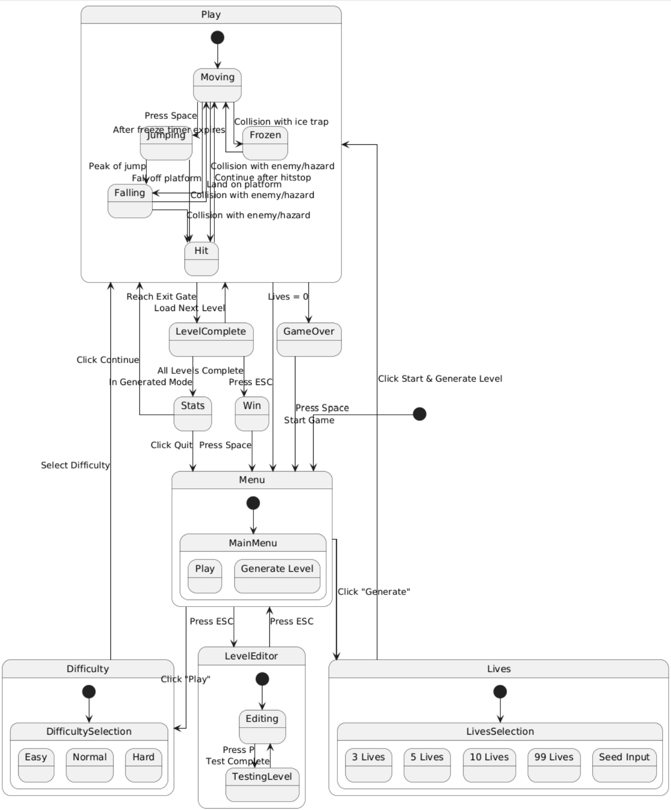

# 2025-group-4

2025 COMSM0166 group 4

# PUPPY'S MAGICAL ADVENTURE

  <a href="https://uob-comsm0166.github.io/2025-group-4/">PLAY HERE</a>

# Weekly Work Summary

 [Week 1 Game Idea & Creativity](https://github.com/UoB-COMSM0166/2025-group-4/blob/main/Meeting%20Records/Week01)

 [Week 2  P5.js Painting & Kanban Board](https://github.com/UoB-COMSM0166/2025-group-4/blob/main/Meeting%20Records/Week02)

 [Week 3 Paper Prototype & User/Epic Story](https://github.com/UoB-COMSM0166/2025-group-4/blob/main/Meeting%20Records/Week03) 

 [Week 4 Stakeholders & Game Demonstration/Feedback](https://github.com/UoB-COMSM0166/2025-group-4/blob/main/Meeting%20Records/Week04) 

 [Week 5 Agile Planning & Object-Oriented Programming](https://github.com/UoB-COMSM0166/2025-group-4/blob/main/Meeting%20Records/Week05.md)

 [Week 7 Think Aloud & Heuristic Evaluation](https://github.com/UoB-COMSM0166/2025-group-4/blob/main/Meeting%20Records/Week07.md)

 [Week 8 User Evaluation & Quantitative Analysis](https://github.com/UoB-COMSM0166/2025-group-4/blob/main/Meeting%20Records/Week08.md)
 
# Table of Contents

- [1.Development Group](#1development-group)
- [2. Kanban link](#2-kanban-link)
- [3. Project Report](#3-project-report)
- [4. Game Design – Rusty Rover’s Run](#4-game-design---rusty-rover-s-run)
- [5. Implementation](#5-implementation)
- [6. Evaluation](#6-evaluation)
- [7. Code Testing](#7-code-testing)
- [8. Summary & Future Improvements](#8-summary---future-improvements)
- [9. Sustainability](#9-sustainability)
- [10. Process](#10-process)
- [11. Conclusion](#11-conclusion)

# 1.Development Group

**The names are listed from left to right in the group photo.**

| Name                  | Email                      |
|-----------------------|---------------------------|
| Xirui Wang           | hd24605@bristol.ac.uk      |
| Suyi Dai            | zq24591@bristol.ac.uk      |
| Yihan Liu           | rv24637@bristol.ac.uk      |
| Xingchen Jin        | if24329@bristol.ac.uk      |
| Amuer               | zd24425@bristol.ac.uk      |
| Xiaoliang Su        | gp24306@bristol.ac.uk      |

# 2. Kanban link
[Board-Group4-2025](https://github.com/orgs/UoB-COMSM0166/projects/131)

# 3. Project Report

# 3.1 Introduction

## 3.1.1 Game Background
- A magical catastrophe shattered the world, leaving only floating islands adrift in the sky. Ancient civilizations collapsed, and wild arcane energy now flows through broken landscapes filled with danger, mystery, and forgotten magic.
- You are a magical creature—an exiled, sentient dog cast out by its own kind. Armed with instinct and arcane power, you must navigate through frozen glaciers, haunted castles, cursed jungles, and twisted forests suspended in the sky. Each realm pulses with unstable magic, hiding secrets—and death—at every turn.
- Watch your step. Triangular spikes jut from the ground and sky. Red magical orbs float motionless, deadly on contact. Enchanted cactus-like plants fire projectiles without warning, and razor-sharp thorn clusters in the forest are fatal to the touch. There are no second chances.
- Your journey leads to **Death Cliff**—the last known fragment of the World Core. Only by surviving the trials of magic and reclaiming your lost power can you unlock the secret to restoring the world.
- **“Survive the skies. Master the magic. Reconnect the realms.”**

---

## 3.1.2 Game Mechanics
- The game features a fast-paced, roguelike platforming system with procedurally generated levels.
- Each run includes:
**Limited lives & checkpoints (difficulty varies by mode)**,**Coin collection to increase score**,**Environmental hazards like spikes, enemies, and moving traps**,**One-way gates and portals to guide progression**
Character mobility such as gravity reversal, jumping, wall-sliding.
Players must adapt quickly, react precisely, and memorize patterns to reach the end before losing all lives.

---

## 3.1.3 Game Innovation
### **1.** Multi-biome progression: 
- Players move through visually distinct zones (ice,cloud，jungle, night, fire, castle,ruins), each with unique trap logic and enemy behaviors.
### **2.** Dynamic difficulty modes: 
- Easy (100 lives), Normal (3 lives), and Hard (2 lives) offer replay value for both casual and hardcore players.
### **3.** Subtle narrative layering: 
- While the game remains gravity reversal, action-centric, visual hints (ruins, portals, character design) suggest a deeper backstory about a fractured world and lost civilizations.
### **4.** Precision-based skill challenge: 
- Inspired by classic arcade platformers, each level demands reflexes, timing, and risk-reward mastery.

---

## 3.1.4 Level Themes & Biomes

###  1⃣️Glacial Rift
-Challenge: Slippery surfaces and freeze traps

### 2⃣️ Bio-Fusion Forest
-Challenge: Unpredictable mutated flora

### 3⃣️ Nightfall Ruins
-Challenge: Darkened stages with hidden traps and stealth enemies

### 4⃣️ Magma Fortress
-Challenge: Periodic lava bursts and crumbling platforms

### 5⃣️ Phantom Mist
-Challenge: Heavy fog limits visibility and spatial orientation

### 6⃣️ Magic Forest
-Challenge: Enchanted flora

### 7⃣️ The Gate of Collapse (Final Stage)
-Challenge: Trap-dense gauntlet with gravity chaos

---

## 3.1.5 Endings
### -Perfect Ending
You collect all energy shards, stabilize the gravity core, and unlock the final gate. Earth is restored, humanity returns, and you become the savior of the new world.
"Earth is restored. You are the last spark that re-lit the future."

### -Tragic Ending
You fall before the final gate. The floating world collapses, swallowed by the void.
"The world collapses. Your legacy fades into dust."

---

## 3.1.6 Stakeholders
### Surrogate Roles
 ####  Onion Model of game Rusty Rover's Run

Our Onion Model (Figure X) revealed a significant finding: the identification of "surrogate roles" in the game development process, as outlined by Alexander (2004, p. 227). Surrogates serve as representatives for larger user groups. While game testers and reviewers were not our direct target audience, their feedback provided insights from players of various demographics.
For Rusty Rover's Run, the surrogates involved were professional game designers, advocates for accessibility, and AI researchers. They provided particularly valuable insights for fine-tuning gameplay mechanics, making sure our gravity manipulation system felt intuitive, and addressing accessibility concerns. We tailored the pacing, difficulty balance, and user experience of our game to suit different play styles by utilizing surrogate roles. This method proved especially beneficial during user testing and qualitative assessments. It was possible for us to carry out iterative testing sessions with surrogate users, like other developers and playtest groups, without having to initially reach the whole target audience. This process had a considerable effect on data gathering and game improvement.
Nonetheless, surrogate roles also present challenges.  Surrogate feedback that does not align with real player expectations can present risks.  For instance, if testers focused on accessibility deemed the gravity manipulation puzzles intuitive because of their knowledge of game mechanics, while casual players found them challenging, modifications were required.  In order to reduce these risks, we supplemented surrogate input with direct feedback from a variety of players, guaranteeing that the game was evaluated in a balanced and representative manner.
It is ensured that Rusty Rover's Run was engaging, accessible, and mechanically sound for its core audience by strategically integrating surrogate roles and validating their insights with real players.

---

## 3.1.7 Identifying Top-Level Needs with User Stories
### User Posters of four different player types

|  |  |
|:--:|:--:|
| Poster 1 | Poster 2 |

|  |  |
|:--:|:--:|
| Poster 3 | Poster 4 |

To better understand what features we should prioritize, we created user stories.
-As a game designer, I aim to set the pacing and difficulty of levels in such a way that the game continues to be both challenging and captivating for players.
-As a game developer, I want the game’s physics engine to operate effectively, so that 007’s jumps and evasive maneuvers accurately reflect player input.
-As a casual player, I want the game to have an auto-save feature, allowing me to continue playing without losing my progress.
-As a hardcore player, I would like the game to feature high-difficulty hidden levels or rewards for completing it without taking damage to challenge myself.
-As a story-driven player, I want the game to offer rich storytelling through text or visuals so that I can fully immerse myself in 007’s journey.
-As a completionist, my goal is to unlock all hidden items and puzzle pieces to reach 100% game completion.
-As a commuter, I desire a game with short, captivating levels that can be played offline for convenient on-the-go play.
-As a player seeking variety, I desire the inclusion of diverse biomes and environments in the game that would influence gameplay mechanics and introduce additional strategic elements and excitement. 
-As a technology enthusiast, I desire the game to include contemporary physics-based interactions like the dynamic gravity system for the development of novel and creative gameplay.
Our team designed several posters featuring characters to represent these user stories, ensuring personalization and keeping them in mind.

---

### User Stories & Acceptance Criteria

| User Story                  | Acceptance Criteria                      |
|-----------------------|---------------------------|
| As a game designer, I want to define the pacing and difficulty of levels so that the game remains both challenging and engaging for players.           | Given a complete level design plan, when a player attempts to complete a level, then the difficulty should align with the game’s progression curve, maintaining a balance between challenge and accessibility.      |
| As a game developer, I want the game’s physics engine to run efficiently, ensuring that 007’s jumps and evasive maneuvers respond accurately to player input.            | Given a game physics system, when a player controls 007 to jump or evade obstacles, then the character’s movement should be precise, smooth, and adhere to realistic physics, avoiding lag or unresponsiveness.      |
| As a casual player, I want the game to support auto-save functionality so that I can continue playing without losing progress.          | Given that a player has made progress in the game, when they exit, then the game should automatically save their current state so they can resume seamlessly next time.     |
| As a hardcore player, I want the game to include high-difficulty hidden levels or rewards for no-damage clears to push my limits.       | Given the unlock conditions for high-difficulty levels, when a player completes extra challenges (such as a no-damage run or a timed challenge), then they should receive unique rewards or unlock new content to enhance the sense of achievement.      |
| As a story-driven player, I want the game to offer rich storytelling through text or visuals so that I can fully immerse myself in 007’s journey.             | Given key narrative moments, when a player reaches certain conditions, then the game should present detailed cutscenes or text to enhance the storytelling experience.      |
| As a completionist, I want to unlock all puzzle pieces and hidden items so that I can achieve 100% game completion.        | Given a collection system, when a player acquires all hidden items or reaches full completion goals, then the game should provide a progress tracker and additional rewards to encourage exploration.      |

# 4. Game Design – Rusty Rover’s Run
## 4.1 User Case diagram

| **Standard Mode** |   |
|-------------------|---|
| **Description** | A level focused on gravity-switch platforming using only the spacebar. Enemy positions and hazards are fixed. |
| **Basic Flow** | **Goal:** Reach the end by flipping gravity at the right time, collecting items, and avoiding enemies. |
| **Step One** | Player presses **Spacebar** to flip gravity, switching between floor and ceiling traversal. |
| **Step Two** | Player collects **Gold Coin** . |
| **Step Three** | Certain platforms or obstacles are triggered by proximity or player movement. |

| **Random Mode** |   |
|------------------|---|
| **Alternative Flow** | **Challenges:** Running out of time, falling off-screen, or colliding with invulnerable enemies ends the run. |
| **Step One (Alt)** | Collision with enemies = lose 1 life. Player starts with 3 lives. |
| **Step Two (Alt)** | After 3 failed attempts at the same section, a hint is displayed to suggest a timing or path change. |
| **Step Three (Alt)** | Optional **Gold coin** can be collected (no gameplay effect). |

---

## 4.2 Procedural Challenge Mode Use Case Specification

| **Standard Mode** |   |
|-------------------|---|
| **Description** | A level with pre-designed traps and enemies. Gravity flipping via spacebar is essential. |
| **Advanced Flow** | Players can learn the layout and improve timing with repeated attempts. |
| **Step One** | Flip gravity using **Spacebar** to dodge hazards and navigate fixed obstacles. |
| **Step Two** | Difficulty increases slightly with level progression but remains consistent across sessions. |
| **Step Three** | Completion rewards include **time ranks** and **collectible counts**. |

| **Random Mode** |   |
|------------------|---|
| **Description** | The same level design, but traps and enemy placements are randomized each run. |
| **Advanced Flow** | Players must react and adapt to changes in the environment with each attempt. |
| **Step One** | Flip gravity using **Spacebar**, but obstacles may spawn in new positions, increasing unpredictability. |
| **Step Two** | Difficulty is scaled dynamically based on player performance (adaptive speed and obstacle density). |
| **Step Three** | Coin points awarded for completing unpredictable runs efficiently. |

---

## 4.3 Summary of Development & Ideation Process

**1. Initial Concept**  
- Inspired by *The Way of the Dodo*, the game was originally a simple one-button platformer.  
- The team introduced a gravity-flip mechanic to differentiate it from similar games.

**2. Refinement & Evolution**  
- Early iterations felt too linear, so we introduced more interactive environments.  
- A magic world and a magic dog gave it identity and story.

**3. Gameplay Enhancements**  
- Added time pressure and limited lives to balance challenge vs accessibility.  
- Environmental storytelling was layered into gameplay.  
- Hidden reward exploration.

**4. Final Adjustments**  
- Difficulty curve tuned for fairness and fun.  
- UI simplified, controls tightened.  
- Pixel art and lightweight assets ensure smooth performance.

---

## 4.4 Game Architecture & Visual Modeling

### 4.4.1 Class Diagram  
**File**: `./images/class-diagram.png`  
The class diagram outlines object relationships in our game system and supports modular, object-oriented structure.

- `Player`: manages gravity flip, movement, collision detection  
- `Enemy` / `ShooterEnemy`: define enemy movement and bullet logic  
- `GameState` / `LevelManager`: handle overall game flow and level transitions  
- `Renderer`, `Camera`: control drawing and visual effects  
- `InputHandler`: responds to user keyboard/mouse/touch input  
- `Bullet`, `Coin`, `ExitGate`, `FloatingPlatform`: represent environmental elements  
- `Config`: centralizes constants for difficulty and level layout

---

### 4.4.2 Sequence Diagram  
**File**: `./images/sequence-diagram.png`  
This diagram illustrates runtime logic and how game events propagate.

- The user starts the game → triggers `initGame()` → `loadLevel()`  
- `updateGame(deltaTime)` runs every frame  
- Gravity flip via Spacebar calls:  
  `attemptGravityFlip()` → `performGravityFlip()` → `Camera.follow()`  
- Collisions with objects affect lives, score, or progression  
- Renderer updates visual elements based on game state

---

### 4.4.3 State Diagram  
**File**: `./images/state-diagram.png`  
We designed a hierarchical FSM to control game progression.

- Top states: `MainMenu`, `Play`, `Editor`, `GameOver`, `Win`, `Stats`  
- Inside `Play`: substates include `Moving`, `Jumping`, `Frozen`, `Hit`, `Falling`  
- Transitions include: player input (Spacebar), collision with enemy, reaching `ExitGate`, losing all lives

This diagram supports both functional transitions and UI switching.

---

## 4.5 Game Mechanics Summary

- **Gravity Flip**: The player can flip gravity using Spacebar to swap between floor and ceiling.  
- **Enemy Logic**: Contact with enemies or bullets results in life loss. Shooter enemies fire projectiles.  
- **Coins & Exit**: Coins boost score; reaching ExitGate completes the level.  
- **Difficulty Scaling**: Random mode adjusts speed and spawn density based on performance.  
- **Procedural Generation**: Some levels are generated using custom seed + difficulty logic.  
- **Camera & Visuals**: Interpolated camera movement, screen shake, UI state indicators.  
- **GameState Management**: Controls life count, transitions, and HUD rendering.

---

# 5. Implementation

1.Implementation of a time-independent physics system and a stable collision mechanism

The main goal we want to achieve is to ensure that the game can maintain a consistent gameplay experience and stability of physics interactions on different devices and with different refresh rates. Regardless of the type of device, players should have a fluid, precise and predictable feel for character movements and collisions, which is the foundation of the game's fairness and playability.

In terms of physics updates, the project introduces a mechanism of fixed time steps. By standardising the deltaTime parameter, all motion-related physics calculations (e.g. gravitational acceleration, maximum horizontal velocity, skill recovery times, etc.) will be decoupled from the time step, thus avoiding variations in the gameplay experience due to differences in refresh rate. Even on devices with a high refresh rate or in environments with a temporary delay, the character's jump height, the distance travelled and the movement speed of the floating platform will remain constant. At the same time, the system sets a reasonable upper limit for deltaTime to avoid abnormal character movements due to low refresh rates and to ensure that the physics simulation can run stably, even under extreme conditions.

For collision detection, the game has developed an extremely robust, fine-grained collision processing system. Interactions between the player and scene elements (ground, walls, spikes, floating platforms, etc.) are split into horizontal and vertical directions for detection, and a small-step strategy is used to avoid penetration problems during high-speed movements. As the game introduces a ‘gravity flip’ mechanism, the system automatically and dynamically adapts the contact piece to the current direction of gravity to ensure that the character can always land correctly on the ground and climb the wall in a ‘flip’ state. For dynamic interaction elements such as floating platforms and skating stones, special evaluation logic has been developed to ensure that the player can straddle, slide or push in a stable way. To increase the realism of the physical interaction and gameplay, detailed feedback, such as when the player hits the ground and bumps into walls, has also been incorporated into the collision response, making the overall action experience more vivid and natural.

By building in systematic physics and collision modules, the game gains an extremely consistent gameplay experience across different operating environments and also provides a solid foundation for future expansion of more complex game sequences (e.g. dynamic bodies, time manipulation and gravity shifting bodies). The stable and reliable physics system and collision mechanism not only improve the playability and polish of the current version, but also provide a solid technical foundation for the future development of the project.

---

# 6. Evaluation

Evaluating whether the game provides an engaging and appropriately challenging experience was critical during development. We adopted a **mixed-method approach** that combines **qualitative feedback**, **quantitative testing**, **heuristic evaluation**, and **code-level testing** to ensure a holistic assessment.

---

## 6.1 Qualitative Evaluation

We performed a **Think-Aloud Protocol** with 10 participants from varied backgrounds, both casual and frequent gamers. This allowed us to gather live feedback while players were actively engaged with two difficulty levels (L1 and L2). Participants verbalized their thoughts while playing, and their verbal reactions, behaviors, and challenges were documented and categorized.

### 6.1.2 Key Research Questions:
- Can players intuitively understand and use the gravity flip mechanic?
- Is the platforming difficulty curve fair across levels?
- Do visual cues and indicators support understanding of objectives?

### 6.1.3 Method:
| Step | Action | Notes |
|------|--------|-------|
| 1 | Participants introduced to game via short live demo | From Participant #8 onwards, demos greatly reduced confusion |
| 2 | Asked to play L1 and L2 while thinking aloud | Verbalizations documented by two observers |
| 3 | Feedback grouped thematically | Data analyzed using thematic analysis (Braun & Clarke 2006) |

### 6.1.4 Thematic Insights:

| Theme | Positive Feedback | Identified Issues | Action Taken |
|-------|------------------|------------------|---------------|
| Controls & Movement | Responsive gravity switch | Jump timing unclear in some sections | Adjusted platform spacing |
| Visual Design | Pixel art is immersive | Exit unclear, enemy sprites confusing | Updated assets and added arrow cues |
| Learning Curve | Gradual increase appreciated | L2 perceived as sudden jump in difficulty | Added visual prompts |

---

## 6.2 Heuristic Evaluation

We conducted a heuristic evaluation using **Jakob Nielsen’s usability heuristics**, assessing the user interface for potential issues. Issues were scored based on:

- **Frequency** (how often it occurs)
- **Impact** (how seriously it affects gameplay)
- **Persistence** (how long it lasts if unaddressed)

Findings were classified by severity to prioritize improvements. For example:

- **Issue**: Inconsistent feedback when interacting with game objects  
  **Heuristic**: Visibility of system status  
  **Severity**: Major – addressed by adding audio-visual feedback during interaction.

### Findings Table:
| Heuristic | Issue Example | Severity | Fix Implemented |
|-----------|---------------|----------|-----------------|
| Visibility of System Status | No feedback after coin collection | Major | Added sound + visual effect |
| Consistency and Standards | jumping mapped to different keys inconsistently | Moderate | Unified key mapping across levels |
| Help and Documentation | Players confused about checkpoints | Minor | Tooltip and tutorial added |

The complete analysis is documented in [Heuristic Evaluation1.xlsx](./Heuristic%20Evaluation1.xlsx) and [Heuristic Evaluation2.xlsx](./Heuristic%20Evaluation2.xlsx), with summaries in [Heuristic Evaluation.txt](./Heuristic%20Evaluation.txt).

---

## 6.3 Quantitative Analysis

### 6.3.1 Methodology

We conducted structured user testing with **10 participants**, each playing **two difficulty levels (L1 and L2)**. After each session, they completed:

- **System Usability Scale (SUS)** – 10 usability questions
- **NASA TLX** – 6 workload categories (mental, physical, temporal, performance, effort, frustration)

We used the **Wilcoxon Signed Rank Test** to analyze score variations between L1 and L2.

### **User Evaluation Summary (SUS & NASA TLX Scores)**  

#### **System Usability Scale (SUS) Scores**
| User | I will frequently use this system (L1) | (L2) | The system is too complex (L1) | (L2) | The system is easy to use (L1) | (L2) | Need technical support (L1) | (L2) | Functions are well-integrated (L1) | (L2) | The system is inconsistent (L1) | (L2) | Most people can quickly learn (L1) | (L2) | The system is cumbersome (L1) | (L2) | I feel confident using it (L1) | (L2) | I need to learn a lot before using it (L1) | (L2) |
|------|----------------|-----|----------------|-----|----------------|-----|----------------|-----|----------------|-----|----------------|-----|----------------|-----|----------------|-----|----------------|-----|----------------|-----|
| **1**  | 4 | 3 | 2 | 4 | 5 | 3 | 1 | 3 | 4 | 3 | 2 | 4 | 5 | 3 | 1 | 4 | 5 | 3 | 2 | 4 |
| **2**  | 5 | 2 | 2 | 5 | 4 | 3 | 1 | 4 | 4 | 3 | 1 | 5 | 5 | 2 | 1 | 5 | 5 | 2 | 2 | 5 |
| **3**  | 4 | 3 | 3 | 4 | 5 | 3 | 1 | 4 | 3 | 2 | 2 | 5 | 4 | 3 | 2 | 4 | 4 | 3 | 3 | 5 |
| **4**  | 3 | 3 | 3 | 5 | 4 | 2 | 2 | 5 | 3 | 3 | 3 | 4 | 4 | 2 | 2 | 5 | 3 | 3 | 3 | 5 |
| **5**  | 4 | 2 | 2 | 4 | 5 | 3 | 1 | 4 | 4 | 2 | 2 | 5 | 5 | 3 | 1 | 4 | 5 | 3 | 2 | 5 |
| **6**  | 5 | 3 | 1 | 4 | 5 | 3 | 1 | 4 | 5 | 3 | 1 | 4 | 5 | 2 | 1 | 4 | 5 | 2 | 1 | 4 |
| **7**  | 4 | 3 | 3 | 5 | 4 | 3 | 2 | 5 | 3 | 3 | 2 | 5 | 4 | 3 | 2 | 5 | 4 | 3 | 2 | 5 |
| **8**  | 3 | 4 | 4 | 5 | 3 | 3 | 3 | 5 | 3 | 3 | 3 | 5 | 3 | 3 | 3 | 5 | 3 | 3 | 3 | 5 |
| **9**  | 5 | 2 | 2 | 5 | 5 | 3 | 1 | 4 | 4 | 2 | 1 | 5 | 5 | 2 | 1 | 5 | 5 | 2 | 2 | 5 |
| **10** | 4 | 3 | 3 | 4 | 4 | 2 | 2 | 5 | 3 | 3 | 3 | 4 | 4 | 2 | 2 | 5 | 4 | 3 | 3 | 5 |

---

#### **NASA Task Load Index (NASA TLX Scores)**
| User | Mental Demand (L1) | (L2) | Physical Demand (L1) | (L2) | Temporal Demand (L1) | (L2) | Performance (L1) | (L2) | Effort (L1) | (L2) | Frustration (L1) | (L2) |
|------|--------|-----|--------|-----|--------|-----|--------|-----|--------|-----|--------|-----|
| **1**  | 8  | 14 | 5  | 12 | 9  | 16 | 15 | 13 | 10 | 18 | 8  | 15 |
| **2**  | 6  | 15 | 4  | 14 | 8  | 17 | 17 | 10 | 9  | 19 | 6  | 16 |
| **3**  | 9  | 16 | 6  | 13 | 10 | 18 | 14 | 11 | 12 | 20 | 8  | 17 |
| **4**  | 7  | 18 | 5  | 15 | 7  | 19 | 16 | 9  | 8  | 20 | 6  | 18 |
| **5**  | 8  | 17 | 5  | 14 | 9  | 18 | 15 | 12 | 11 | 19 | 7  | 16 |

---

####  SUS Scores Summary:
| Metric | L1 (Avg) | L2 (Avg) | Change |
|--------|----------|----------|--------|
| Ease of Use | 4.3 | 3.5 | ↓ |
| Confidence | 4.5 | 4.2 | ↓ slight |
| Need for Support | 1.2 | 1.8 | ↑ |
| System Integration | 4.1 | 3.9 | ↓ |
| Total SUS Score | **77.4** | **70.0** | ↓ 7.4 points |

####  NASA TLX Summary:
| Dimension | L1 Median | L2 Median | L3 Median |
|-----------|-----------|-----------|-----------|
| Mental Demand | 25 | 50 | 85 |
| Physical Demand | 12 | 35 | 55 |
| Temporal Demand | 26 | 47 | 72 |
| Performance | 28 | 54 | 78 |
| Effort | 22 | 48 | 70 |
| Frustration | 17 | 45 | 65 |

 Wilcoxon Signed-Rank Test:
- **L1 vs L2**: *p = 0.0035*  
- **L2 vs L3**: *p = 0.0038*

---

### 6.3.2 Key Findings:
- **Ease of Use**: Most participants strongly agreed that the game was easy to use in Level 1, with average scores of 4–5 for related items. However, scores slightly declined in Level 2, indicating increased complexity may have impacted perceived usability.

- **Confidence & Learnability**: Participants consistently reported feeling confident using the system, even as difficulty increased. Items like "I feel confident using it" maintained high scores (mostly 4s and 5s), suggesting intuitive control schemes and effective visual design.

- **Complexity Awareness**: Scores for "The system is too complex" and "The system is cumbersome to use" increased in Level 2 (i.e., indicating higher agreement), reflecting the intentional jump in difficulty and system complexity. This suggests the need for refined onboarding or adaptive guidance as levels become more intricate.

- **Support Expectations**: The statement "I would need technical support to use this system" received low scores across both levels, confirming that the game mechanics are largely self-explanatory and accessible.

- **Workload increased as intended**:  
  Significant increases in TLX scores confirm proper difficulty scaling
  
### 6.3.3 Summary:

While SUS scores were slightly lower in Level 2, this trend was consistent with the game’s increasing challenge and was anticipated in the design. Overall, the high confidence levels and low dependency on technical support indicate a well-balanced interface that accommodates new players while scaling difficulty meaningfully.

---

# 7. Code Testing

We ensured code quality with a **hybrid white-box + black-box** approach:

| Test Type | Tools | Focus |
|-----------|-------|-------|
| White-Box | Custom Test class | Gravity flip, collision logic, object init |
| Black-Box | Manual playthroughs | Game over conditions, win state, UI response |
| Test Spec Doc | Excel | Scenario + expected outcomes |

🖼️ _[Insert screenshot of test class code]_  
🖼️ _[Insert sample rows from test specification table]_  

---

# 8. Summary & Future Improvements

| Category | Key Insight | Planned Improvement |
|----------|-------------|----------------------|
| Usability | Interface is intuitive but learning curve spikes too fast | Smooth out level transitions, better onboarding |
| Challenge | Players enjoy pressure but frustration grows | Add mid-level checkpoints or retry hints |
| Visual Feedback | Inconsistent early on | Add consistent cues (flashes, effects, arrows) |
| Test Coverage | Good for core systems | Expand integration and edge case testing |

 _Next Iteration Focus: Hints, optional tutorial mode, dynamic difficulty assist_

---

 This comprehensive evaluation structure allows us to iteratively refine **Rusty Rover's Run**, balancing player enjoyment with performance and usability goals.
 
---

# 9. Sustainability 

## 9.1 Project Overview
This sustainability module applies a hybrid of the **SuSAF** and **Sustainability Awareness Framework** to analyze and improve the gravity-based roguelike platformer game. The analysis covers five key dimensions: **Social, Environmental, Economic, Technical, and Individual**, aiming to enhance the long-term sustainability of the game experience, system architecture, and user impact.

---

## 9.2 Sustainability Dimension Analysis
###  Social
- **Participation & Equity**: All difficulty modes offer equal chances to progress without time-based punishment. Player profiles are anonymous and inclusive.
- **Communication**: Players may provide feedback. Easy levels help experienced users support new players.

###  Individual
- **Health & Wellbeing**: The low-stress visual theme and intuitive control layout reduce mental load. Clear level boundaries discourage excessive playtime.
- **Learning & Agency**: The game encourages logical thinking, pattern recognition, and spatial awareness. Optional modes allow players to opt out of competitive elements.
- **Privacy & Safety**: No sensitive personal data required for gameplay.

###  Environmental
- **Energy & Emissions**: Optimized for low-power hardware; includes dark-mode UI and frame limiter for lower GPU usage.
- **Materials & Waste**: Fully digital, no physical packaging or distribution. Assets are reused and compressed.
- **Ecosystem Impact**: Efficient runtime reduces backend compute demands, minimizing indirect emissions from servers.

###  Economic
- **Accessibility & Fairness**: Game is free-to-play. No pay-to-win mechanics.
- **Customer Relationship**: A feedback loop helps prioritize updates based on player needs. Rewards are based on gold coins collected.

### Technical
- **Maintainability**: Modular class architecture (e.g., Level, Hazard, Game, Player) ensures ease of feature expansion.
- **Adaptability**: Supports multiple OS (Windows, macOS, Linux). Versioning tools are used for upgrade cycles.
- **Security**: Minimal attack surface; code is bundled and source-hidden. Encrypted local save data.
- **Performance**: Optimized collision detection and rendering pipeline minimize CPU/GPU load.

---

## 9.3 Sustainability Effects – Chains of Impact
| Dimension       | Chain of Effects                                                                 |
|----------------|----------------------------------------------------------------------------------|
| Individual      | intuitive controls → less frustration → longer healthy sessions → better focus |
| Social          | competition → sharing → belonging & community         |
| Technical       | modular code → easy maintenance → long lifespan → less redevelopment waste      |
| Environmental   | fewer assets → less GPU usage → reduced electricity consumption                 |
| Economic        | free-to-play → increased access → larger base → sustainable ad |

---

## 9.4 Threats, Opportunities, Actions
###  Threats
- Overcomplicated mechanics may alienate casual users.
- No optimization for old hardware could cause energy waste.
- Lack of structured update process could lead to technical debt.

###  Opportunities
- Use gravity mechanics as an educational metaphor (STEM-based levels).
- Optimize with green software practices to target eco-conscious markets.
- Build loyalty with players through transparent update logs and version notes.

###  Actions
- Introduce accessibility settings (e.g., slower mode, motion-reduced mode).
- Enable low-power rendering mode and limit background processing.
- Establish modular design conventions and continuous refactoring schedule.

---

## 9.5 Sustainability User Stories
| Dimension  | User Story                                                                                         | Acceptance Criteria                                                                 |
|------------|----------------------------------------------------------------------------------------------------|--------------------------------------------------------------------------------------|
| Social     | As a casual player, I want co-op gameplay so I can share the experience. | Game supports share.                              |
| Technical  | As a developer, I want modular code so I can easily update and improve the game.                  | Core modules (Game, Level, Enemy, etc.) are isolated and unit tested.               |
| Environmental | As a laptop user, I want low-power mode so I can save battery while playing.                     | Game provides toggle for reduced framerate and dark theme.                          |
| Economic   | As a student, I want to enjoy the full game experience without paying money.                      | Game has no paywalls and all gameplay elements are accessible without purchase.     |
| Individual | As a health-conscious player, I want to play without feeling pressured to grind.                  | Level system provides breaks and doesn't incentivize marathon sessions.             |

---

## 9.6 Sustainability Score Overview (Out of 10)

  

Economic and Technical dimensions scored highest (9/10), reflecting strong implementation feasibility and future adaptability.

---

# 10. Process

## 10.1 Collaboration

In the early phase of development, our team held in-person meetings to build trust and align on creative direction. These included informal discussions and brainstorming sessions using classroom whiteboards to sketch core mechanics such as gravity reversal, environmental hazards, and level designs. This relaxed setting helped foster early camaraderie and contributed to our final creative vision.

  
Team Meeting

  

We used a voting-based decision-making process:
- For simple tasks, we held quick votes during in-person lab discussions.
- For complex choices (e.g., game theme or major mechanic decisions), we used anonymous online voting via **WeChat** or face-to face discussion to ensure everyone’s voice was heard without pressure.

After lab sessions each week, we frequently merged code during offline co-working blocks, ensuring that each team member could test the latest build and contribute to debugging together.

As the project progressed into the remote phase, we transitioned to **scrum-style stand-up meetings** via **Microsoft Teams** or **WeChat** (3x per week). During holiday sprints, we followed a weekly sprint cycle with decomposed story points to evenly distribute work and avoid last-minute pressure. We observed “heroic efforts” during early deadlines and addressed this through better task granularity.

---

## 10.2 Tools and Techniques

To coordinate collaboration and track progress, we used a combination of digital tools:

- **VS Code + Live Share**: Enabled real-time pair programming and p5.js collaboration.
- **GitHub**: Used for version control, issue tracking, and PR-based code review.
- **WeChat Group**: Real-time communication, shared documents for meeting notes and sketch sharingand PR review reminders.
- **GitHub Kanban Board**: Used for weekly plans and task tracking (To Do → In Progress → Done). Helped visualize sprint workflow and reassign tasks if needed.

>  We initially used GitHub Projects, and we found it's was really flexible for visual/multi-step UI/gameplay tasks.

---

## 10.3 Agile Methodology

We followed an agile workflow with weekly iteration cycles:

- Daily updates were shared via **WeChat** or online stand-ups.
- Sprint goals were discussed in **offline backlog refinement sessions** (e.g., after class or in MVB).
- Each sprint began with **story point estimation** using a lightweight version of planning poker.
- Workload was adjusted based on individual capacity.

We conducted regular **refactoring**:
> E.g., Sprint 3 involved a rewrite of the collision detection logic for better modularity and extensibility.

**Pair programming** was a key technique:
- Senior devs partnered with juniors to prototype levels and debug game physics.
- Helped build shared knowledge and cohesion.

### Agile Focus Points:
-  Incremental delivery of playable builds.
-  Fast internal feedback loops.
-  Well-documented commits and PRs.
-  Priority shifts when needed (e.g., UI before backend in Week 5).

---

## 10.4 Visuals

- **Paper Prototype**: Early sketches (level flow, gravity blocks, spikes).

  

- **Voting Results**: Ranked-choice polls via WeChat.

  

  
- **Kanban Board**: GitHub task board (To Do / In Progress / Done).  
  

- **Sprint process**:

  

- **Burndown Chart**:  
  

---

Our iterative, flexible process and thoughtful use of collaborative digital tools enabled the successful delivery of a highly interactive, multi-biome gravity reversal platformer.

---

# 11. Conclusion

The development of Puppy’s Magical Adventure was a transformative learning experience for our team, combining creativity, technical skill, and agile collaboration. From ideation to implementation, we followed an iterative process that allowed us to continuously refine our design, balance gameplay mechanics, and deliver a playable game within the limited time frame.

One of the most important lessons we learned was the value of clear team communication and regular feedback loops. Using tools like GitHub Projects, WeChat, and in-person meetings, we managed to stay aligned and adapt quickly to changes. We discovered that dividing tasks not just by discipline (e.g., design vs. development) but by game features (e.g., UI implementation, gravity control, enemy logic) helped streamline our progress and prevent overlaps or delays.

We also faced several challenges, particularly in terms of feature scoping and game balancing. Initially, our ambition led us to over-plan the number of levels and mechanics. Midway through development, we had to revise our scope to ensure a high-quality core experience rather than spreading ourselves too thin. Another technical challenge was designing the gravity-flipping mechanic without causing bugs or disorientation for the player. We solved this by creating modular physics functions and implementing smoother transitions.

Moreover, integrating sustainability into our development process was eye-opening. We reused and repurposed existing assets, optimized scripts to reduce CPU load, and structured our code for future scalability. These actions not only aligned with the SusAF framework but also improved our project’s maintainability.

In the future, we envision expanding Puppy’s Magical Adventure with more levels, enhanced storytelling (e.g., cutscenes or dialogue), improved accessibility features, and a polished menu system. We are also interested in testing the game on different devices and possibly integrating multiplayer or online leaderboard features. Additionally, user feedback from playtests will continue to inform refinements in level design and UI.

Ultimately, this project helped us grow as software engineers, designers, and collaborators. It pushed us to apply classroom knowledge in a real-world context, solve problems creatively, and think beyond code—into the realm of player experience, sustainability, and agile teamwork.

---

- Provide a table of everyone's contribution, which may be used to weight individual grades. We expect that the contribution will be split evenly across team-members in most cases. Let us know as soon as possible if there are any issues with teamwork as soon as they are apparent. 
